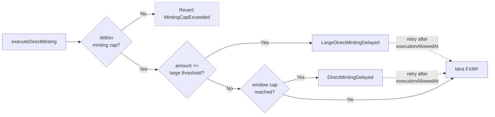

import CodeBlock from "@theme/CodeBlock";
import FAssetsDirectMintingLimits from "!!raw-loader!/examples/developer-hub-javascript/fassetsDirectMintingLimits.ts";

## Overview

This guide reads the on-chain [minting](/fassets/minting#rate-limits) rate limits, replays the tumbling-window state off-chain, and pre-flights a proposed mint against every mechanism that can hold it back:

1. **Global minting cap** — [`mintingCapAMG`](/fassets/reference/IAssetManager#getsettings) is checked and reserved **before** the rate limits, and it **reverts** with `MintingCapExceeded`
2. **Hourly window** — [`directMintingHourlyLimitUBA`](/fassets/reference/IAssetManager#getdirectmintinghourlylimituba) via the `MintingRateLimiter` library
3. **Daily window** — [`directMintingDailyLimitUBA`](/fassets/reference/IAssetManager#getdirectmintingdailylimituba) via the same library
4. **Large-mint rule** — amounts **at or above** [`directMintingLargeMintingThresholdUBA`](/fassets/reference/IAssetManager#getdirectmintinglargemintingthresholduba) incur a fixed [`directMintingLargeMintingDelaySeconds`](/fassets/reference/IAssetManager#getdirectmintinglargemintingdelayseconds) hold

Only the minting cap rejects; the three throttles delay.
Over-limit mints emit [`DirectMintingDelayed`](/fassets/reference/IAssetManagerEvents#directmintingdelayed) (windows) or [`LargeDirectMintingDelayed`](/fassets/reference/IAssetManagerEvents#largedirectmintingdelayed) (large mints) with an `executionAllowedAt` timestamp.

The large-mint rule and the windows are **mutually exclusive**: a large minting takes its own branch, so it is never also throttled by the hourly or daily window — and it consumes no window capacity.
Within the window branch, the binding delay is whichever of the two windows pushes `executionAllowedAt` further into the future.



A delayed minting keeps its reserved capacity, and the retry re-enters `executeDirectMinting` with the same FDC proof: the cap and the limiters are not re-evaluated, so it mints as soon as `executionAllowedAt` has passed.
Calling before that reverts with `DirectMintingStillDelayed`.

The complete runnable example is available in the [flare-viem-starter](https://github.com/flare-foundation/flare-viem-starter/blob/main/src/fassets/direct-minting-limits.ts) repository.

## How the windows work

`MintingRateLimiter` uses **clock-aligned tumbling windows**, not rolling windows.
On initialization, the window start is snapped to a multiple of `windowSizeSeconds`:

```text
windowStartTimestamp = block.timestamp - block.timestamp % windowSizeSeconds
```

With `windowSizeSeconds = 3600`, the hourly window aligns to UTC hour boundaries (00:00-01:00, 01:00-02:00, …).
The daily window (`86400` seconds) aligns to 00:00 UTC.

On every write, the limiter advances the window:

```text
windowsElapsed        = (now - windowStartTimestamp) / windowSizeSeconds
mintedInCurrentWindow = subOrZero(mintedInCurrentWindow, windowsElapsed * maxPerWindow)
windowStartTimestamp += windowsElapsed * windowSizeSeconds
```

Three consequences worth noting:

1. **Unused capacity does not roll over.**
   `subOrZero` clamps at zero, so an idle hour does not give twice the cap the next hour — every fresh window starts at exactly `maxPerWindow`.
2. **Over-cap mints are delayed, not rejected.**
   `executionAllowedAt` is set to `windowStartTimestamp + windowSize * mintedInCurrentWindow / maxPerWindow`, so overflow drains hour-by-hour through the `subOrZero` step.
3. **The cap boundary is inclusive.**
   A minting executes immediately only while `mintedInCurrentWindow < maxMintingPerWindow`, so a mint that lands exactly on the cap is already delayed.
   The largest amount that still executes immediately is one AMG below the remaining headroom.

Reading the limiter state on its own returns stale `(windowStart, minted)` values until the next write touches the contract, so this script replays the slide off-chain to show the values as they would be right now.

## Large minting delay

Large-mint delay is **not** part of `MintingRateLimiter`.
It applies when the proposed mint amount is **greater than or equal to** `directMintingLargeMintingThresholdUBA`:

```text
if amountAmg >= directMintingLargeMintingThresholdAmg:
    executionAllowedAt = now + directMintingLargeMintingDelaySeconds
else:
    hourly and daily limiters run
```

Because this is an `if`/`else`, a large minting bypasses the hourly and daily limiter completely: it is never delayed by a window, and the amount is not recorded against either window.
A large minting is always delayed — even with a zero delay it is registered as a delayed minting and needs a second `executeDirectMinting` call with the same FDC proof.

On Flare mainnet, the threshold and delay are currently **4M XRP** and **2 hours** respectively (see [Operational Parameters](/fassets/operational-parameters)).

## Global minting cap

Before any rate limit runs, [`executeDirectMinting`](/fassets/reference/IAssetManager#executedirectminting) reserves minting capacity against the FAsset-wide cap:

```text
totalAMG = totalReservedCollateralAMG + toAmg(fAsset.totalSupply())
require(totalAMG + amountAmg <= mintingCapAMG)   // else MintingCapExceeded
```

This one **reverts** — there is no delay and no event.
The cap is disabled when `mintingCapAMG` is `0`.
The `totalReservedCollateralAMG` (collateral reservations plus already-delayed direct mintings, whose capacity stays reserved while they wait) has no getter, so an off-chain headroom of `mintingCap - totalSupply` is an **upper bound**.

## Prerequisites

- The [flare-viem-starter](https://github.com/flare-foundation/flare-viem-starter) cloned locally with dependencies installed.
- A configured `publicClient` pointing at the [Flare network](/network/overview) you want to query (Coston2 by default in the starter).

## Minting Limits Script

<CodeBlock language="typescript" title="src/fassets/direct-minting-limits.ts">
  {FAssetsDirectMintingLimits}
</CodeBlock>

## Code Breakdown

1. **Window sizes.**
   `HOURLY_WINDOW_SECONDS` and `DAILY_WINDOW_SECONDS` are the `windowSizeSeconds` values the `MintingRateLimiter.sol` library uses — `3600` aligns to UTC hour boundaries, `86400` aligns to 00:00 UTC.
   Both are fixed when the asset manager is initialized (`1 hours` and `1 days`) and there is no getter for them.
2. **Format helpers.**
   `formatUba` prints raw UBA (units of basis assets) alongside the XRP equivalent via `dropsToXrp`.
   `formatDuration` turns a number of seconds into `1d 1h 1m 1s`, keeping interior zeros so a two-hour delay reads `2h 0m 0s`, and `formatTimestamp` pairs ISO time with that duration as a relative offset (`in …` / `… ago`) so it is clear whether a timestamp is in the future or the past.
3. **Replay the limiter slide.**
   `computeWindowState` mirrors the window-advancement logic in `MintingRateLimiter.sol`: it advances `windowStart` past every tumble that has elapsed and drains `mintedInCurrentWindow` by `windowsElapsed * limit`.
   Without this off-chain replay, you would see stale numbers between writes.
   It reports both the headroom to the cap and `maxWithoutDelayUBA`, which is one AMG lower because the on-chain check is `minted < limit`.
4. **Window delay math.**
   `computeWindowExecutionAllowedAt` applies the proportional overflow formula from `MintingRateLimiter`: when `used + proposed` reaches the cap, `executionAllowedAt = effectiveStart + windowSize * (used + proposed) / limit`.
5. **Large-mint branch.**
   `isLargeMinting` uses the same inclusive `>=` comparison as the contract.
6. **Combine the mechanisms the way the contract does.**
   `computeDirectMintingExecutionAllowedAt` returns the large-mint timestamp on its own when the amount is large, and otherwise takes the maximum of the hourly and daily timestamps.
   It also reports which event the contract would emit.
7. **Print one window's live state.**
   `printWindow` shows the live cap, used amount and percentage, remaining headroom, the largest non-delayed mint, the effective window start, and the next UTC tumble.
8. **Resolve `AssetManagerFXRP`.**
   `getContractAddressByName("AssetManagerFXRP")` looks up the asset manager through the [Flare Contract Registry](/network/guides/flare-contracts-registry).
9. **Pin the snapshot to one block.**
   `getLatestBlock` provides the block number every read is pinned to, and its `timestamp` is used as `now`.
   The limiter compares against `block.timestamp`, so replaying the windows against the local clock would drift, and unpinned reads could straddle blocks.
10. **Read everything in parallel.**
    `Promise.all` fetches the [asset manager settings](/fassets/reference/IAssetManager#getsettings) (AMG granularity, FAsset address, minting cap), the [hourly](/fassets/reference/IAssetManager#getdirectmintinghourlylimituba) and [daily](/fassets/reference/IAssetManager#getdirectmintingdailylimituba) caps, the raw limiter state for [hourly](/fassets/reference/IAssetManager#getdirectmintinghourlylimiterstate) and [daily](/fassets/reference/IAssetManager#getdirectmintingdailylimiterstate) windows, the [`unblockUntilTimestamp`](/fassets/reference/IAssetManager#getdirectmintingsunblockuntiltimestamp), and the [large-minting threshold](/fassets/reference/IAssetManager#getdirectmintinglargemintingthresholduba) and [delay](/fassets/reference/IAssetManager#getdirectmintinglargemintingdelayseconds) in one round trip.
11. **Convert AMG to UBA.**
    The limiter stores `mintedInCurrentWindow` in AMG (`uint64`) for cheap on-chain storage.
    Multiplying by [`assetMintingGranularityUBA`](/fassets/reference/IAssetManager#assetmintinggranularityuba) rebases it into UBA (units of basis assets) so it can be compared against the UBA-denominated cap.
12. **Global minting cap headroom.**
    `checkMintingCap` works in AMG, so the supply is floored to whole AMG the way `Conversion.convertUBAToAmg` does before subtracting it from `mintingCapAMG`.
    The result is still an upper bound, because reserved capacity is not readable off-chain; beyond it the mint reverts instead of being delayed.
13. **Report the governance unblock.**
    [`getDirectMintingsUnblockUntilTimestamp`](/fassets/reference/IAssetManager#getdirectmintingsunblockuntiltimestamp) is always a **past** timestamp: governance uses it to release mintings that were already delayed and started before it, not to switch the limiter off.
    New mintings are still rate-limited, so it does not enter the pre-flight math.
14. **Safe maximum.**
    The largest amount that neither delays nor reverts is the minimum of both windows' `maxWithoutDelayUBA`, one AMG below the large-mint threshold, and the cap headroom.
15. **Pre-flight a concrete amount.**
    Set `MINT_PREFLIGHT_XRP` (defaults to `10`) to see whether that mint executes immediately, reverts with `MintingCapExceeded`, or emits a delay event.
    The amount is floored to whole AMG first, exactly as `Conversion.convertUBAToAmg` does on chain.
    A delayed mint does not revert — the executor retries with the same FDC proof after `executionAllowedAt`.

## Important Notes

- **The minting cap rejects, the rest throttle.**
  `MintingCapExceeded` is a revert raised before the limiters, so a pre-flight that only checks the windows can advertise an amount the chain refuses outright.
- **Large mintings take their own branch.**
  Amounts at or above [`directMintingLargeMintingThresholdUBA`](/fassets/reference/IAssetManager#getdirectmintinglargemintingthresholduba) are delayed by [`directMintingLargeMintingDelaySeconds`](/fassets/reference/IAssetManager#getdirectmintinglargemintingdelayseconds), skip the hourly and daily limiter, and consume no window capacity.
- **Boundaries are inclusive.**
  Minting exactly at the large-mint threshold is delayed, and so is a mint that lands exactly on a window cap.
- **Governance unblock is retroactive.**
  [`unblockDirectMintingsUntil`](/fassets/reference/IAssetManager#getdirectmintingsunblockuntiltimestamp) only accepts timestamps in the past and releases already-delayed mintings that started before that timestamp — including large-minting delays.
  It never exempts a new minting from the limiter.
- **Reads are stale between writes.**
  Always advance the window off-chain when displaying live limiter state.
- **Plan UI flows around [`DirectMintingDelayed`](/fassets/reference/IAssetManagerEvents#directmintingdelayed) and [`LargeDirectMintingDelayed`](/fassets/reference/IAssetManagerEvents#largedirectmintingdelayed)** so users are not surprised by a deferred execution.
- **Delay and cap failures** — see [Delays](/fassets/troubleshooting/minting-troubleshooting#delays) in the Minting Troubleshooting guide for retry steps when rate limits bind.

:::tip[What's next]

To continue your FAssets development journey, you can:

- Mint with the 32-byte memo flow in [Mint FXRP](/fassets/developer-guides/fassets-mint).
- Mint with a reserved tag in [Mint FXRP with Tag](/fassets/developer-guides/fassets-mint-tag).
- Read the protocol details in [Minting](/fassets/minting).

:::
