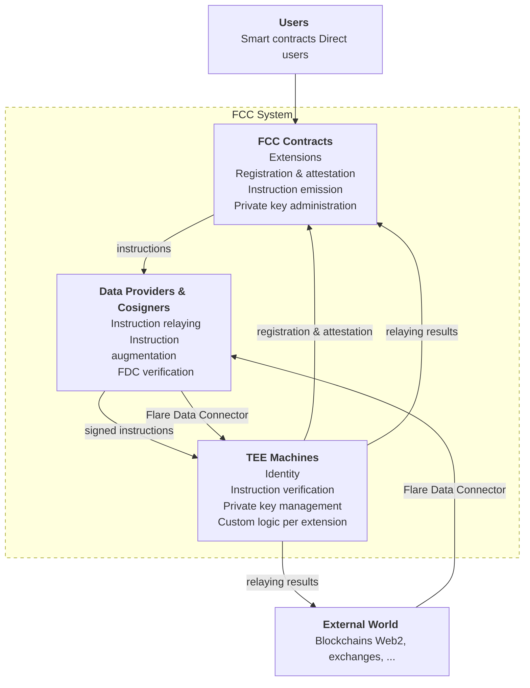
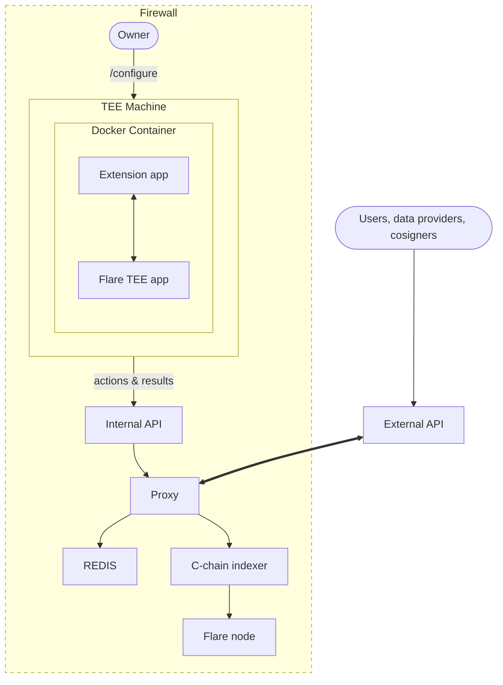

import ThemedImage from "@theme/ThemedImage";
import useBaseUrl from "@docusaurus/useBaseUrl";

**F**lare **C**onfidential **C**ompute **(FCC)** extends the Flare blockchain with [Trusted Execution Environments (TEEs)](https://en.wikipedia.org/wiki/Trusted_execution_environment) to enable secure off-chain computation, cross-chain transaction signing, and fast data attestation.
FCC provides infrastructure for building custom, secure TEE integrations through a system of **Flare Compute Extensions (FCE)**; useful for dealing with private data.
It also delivers two built-in system applications: **Protocol Managed Wallets (PMW)** and a new generation of the [Flare Data Connector (FDC)](/fdc/overview).

## Key Features

- **Secure Offchain Computation:** TEE machines run verifiable code in hardware-isolated environments, ensuring computation integrity even if the machine operator is untrusted.
- **Cross-Chain Transaction Signing:** Protocol Managed Wallets enable programmable assembly and signing of transactions on external blockchains (XRPL, BTC) through smart contract calls on Flare.
- **Fast Data Attestation:** A new TEE-based FDC enables rapid attestation of external data, where TEE machine signatures serve as proof of data provider consensus.
- **Extensible Architecture:** Developers can build custom Flare Compute Extensions that run arbitrary computations within TEE machines, with results verifiable onchain.
- **Decentralized Consensus:** Instructions are relayed to TEE machines only after reaching a 50%+ signature weight from Flare's data providers, leveraging the same [signing policy](/network/fsp) used across the Flare Systems Protocol.
- **Private Key Management:** TEE machines securely generate, store, back up, and restore private keys, enabling multi-signature wallet operations across blockchains.

:::danger
Although the Flare confidential compute is in the final stages of development, it is not yet publicly available.
Stay tuned for that and the upcoming guides.
:::

## Architecture

The system comprises three core components:

1. **Smart Contracts** on the Flare blockchain govern the underlying logic.
   This includes the management of compute extensions, the registration and attestation of TEE machines, the issuance of instructions for secure relay to TEE machines, and the administration of private keys generated and stored within TEEs.

2. **Data Providers and Cosigners** function as instruction relayers.
   They parse instruction events from smart contracts, augment them with external data, sign them, and transmit them to TEE machines.
   Cosigners provide an additional layer of authorization for sensitive operations like payments and key management.

3. **TEE Machines** verify that instructions carry adequate consensus (threshold signature weight) from data providers and cosigners.
   Upon successful verification, the TEE machine executes the corresponding computation and signs the result with a relevant private key.
   Results include signed payment transactions for external blockchains, signed attestations, or other computation outputs usable within smart contracts.

### Deployment

Each TEE deployment consists of two main components:

- **TEE Machine:** Runs inside a confidential virtual machine and is not publicly accessible.
  It sits behind a firewall and has a single configuration endpoint used by the owner.
  The TEE machine pulls actions from the proxy at its own pace, processes them, and pushes results back.

- **TEE Proxy:** A publicly accessible server that acts as the interface between the outside world and the TEE machine.
  It receives signed instructions from data providers, manages action queues, stores results, and serves them to external users.
  The proxy also monitors the Flare C-chain for signing policy updates.

## Flare Confidential Compute Extensions

Applications within FCC are organized as **Flare Compute Extensions (FCE)**.
Each compute extension represents an isolated set of functionalities running on TEE machines, extending the concept of smart contracts into TEE environments.
A compute extension is defined by:

- **Supported code versions:** Each code version is a hash of the Docker image running in the confidential VM and must be reproducible.
- **Registered TEE machines:** Machines running supported code versions that have been registered with an onchain attestation proof.

The FCC infrastructure provides the following for all compute extensions:

- **Identity:** Each TEE machine has a unique identity (TEE id) defined by a private key generated at boot.
- **Onchain Registration:** TEE machines register within a compute extension by proving they run a supported code version, verified through machine attestation and the FDC.
- **Result Verification:** Data and computation results signed by a registered TEE identity can be trusted and verified onchain.
- **Instruction Relaying:** Function calls on TEE machines are triggered through instruction events on Flare's smart contracts, securely relayed by data providers.
- **Private Key Management:** Compute extensions support secure key generation, backup, and restoration across TEE machines.

## System Applications

### Protocol Managed Wallets (PMW)

PMW enables programmable assembly, signing, and execution of transactions on external blockchains through smart contract calls on Flare.
This introduces blockchain abstraction and external execution capabilities on Flare.

Key capabilities:

- **Multisig Operations:** Wallets represent sets of private keys across multiple TEE machines, acting as signers on k-of-n native multisig accounts on external blockchains (XRPL, BTC), where any k of the n keys are sufficient to authorize a transaction.
- **Nonce Management:** Each payment instruction is issued with a unique nonce.
  On UTXO blockchains, nonces are emulated through transaction chaining.
- **Reissuance and Nullification:** Transactions can be reissued with different fees, or nullified by consuming the nonce with a minimal-fee transaction.
- **Execution Proofs:** FDC attestation proofs verify whether a payment was executed as expected, enabling protocols to automatically mitigate failed payments.

### Flare Data Connector (FDC)

The TEE-based FDC achieves fast attestation by issuing instruction events containing attestation requests.
Data providers parse these requests, perform attestations using their existing data provision capabilities, and augment instructions with attestation responses.

Each TEE machine that receives a threshold weight of signatures from data providers and cosigners signs the attestation response with its TEE identity key.
Since TEE machine identities are verified on-chain during registration, their signatures serve as proof of data provider consensus usable within smart contracts.
