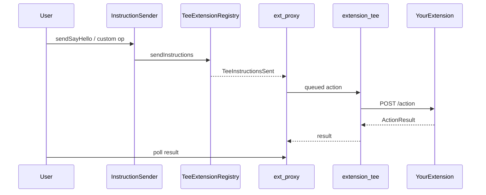

import CodeBlock from "@theme/CodeBlock";
import InstructionSender from "!!raw-loader!/examples/developer-hub-fcc-scaffold/contracts/InstructionSender.sol";
import ConfigGo from "!!raw-loader!/examples/developer-hub-fcc-scaffold/internal/config/config.go";
import ExtensionGo from "!!raw-loader!/examples/developer-hub-fcc-scaffold/internal/extension/extension.go";
import TypesGo from "!!raw-loader!/examples/developer-hub-fcc-scaffold/pkg/types/types.go";
import RegisterGo from "!!raw-loader!/examples/developer-hub-fcc-scaffold/pkg/types/register.go";

Build your first **Flare Confidential Compute (FCC)** extension from the Hello World scaffold example.
This guide walks you through the setup and testing flow, how extensions fit into the TEE stack, which files you customize, and how to deploy and test on **Coston2** testnet.

Find the scaffold example on [GitHub](https://github.com/flare-foundation/fce-extension-scaffold).
For background on FCC and Flare Compute Extensions (FCE), see the [FCC overview](/fcc/overview).

:::info[What you will build]
A Go HTTP server that runs inside a Trusted Execution Environment (TEE).
Onchain callers send instructions through your `InstructionSender` smart contract; the TEE infrastructure relays them to your extension's `POST /action` handler, and you return results that callers poll from the extension proxy.
:::

## Overview

The scaffold ships a working **GREETING** extension with two commands:

1. **`SAY_HELLO`** — JSON payload `{"name":"..."}`; returns a greeting string and increments a counter.
2. **`SAY_GOODBYE`** — ABI-encoded `(name, reason)`; returns a farewell string and increments a counter.

In this guide, you will:

1. Clone the scaffold and its build dependencies (`tee-node`, `tee-proxy`).
2. Learn the instruction lifecycle and which files you own.
3. Deploy the Hello World smart contract and TEE stack against the Coston2 testnet.
4. Customize the OPType and OPCommand handlers and the onchain entry point for your own extension.

## How an Extension Works

An extension does not communicate directly with the chain.
A user (or another contract) calls your Solidity `InstructionSender` smart contract, which calls the `TeeExtensionRegistry.sendInstructions()` function.
Data providers relay the instruction; your local `ext-proxy` queues it; the TEE node delivers it to your extension.



You control steps that start and end the flow: the onchain `InstructionSender` smart contract and the Go action handlers.
Attestation, signing, and message routing are handled by the TEE node and proxy.

## Architecture

The extension stack runs as three Docker services:

- **`extension-tee` TEE node:** TEE node plus your Go extension (listens for `POST /action` and `GET /state`).
- **`ext-proxy` proxy server:** Watches Coston2 testnet for instructions targeting your extension, forwards them to the TEE, and exposes results and `/info` on the public proxy URL.
- **`redis` database:** In-memory store used by the proxy for queue and internal state.

## Clone the Scaffold Example

This example's Docker build scripts expect `tee-node`, `tee-proxy`, and the scaffold as sibling directories under a common parent — the extension module uses a `replace` directive for [`tee-node`](https://github.com/flare-foundation/tee-node), and `start-services.sh` builds [`tee-proxy`](https://github.com/flare-foundation/tee-proxy) unless you set `REGISTRY` to a remote image registry.
Clone the repositories in the layout below before you build.

:::warning[Use the `develop` branch]
FCC extension work currently requires the **`develop`** branches of `tee-node` and `tee-proxy` (not `main` or older release tags).
Check out `develop` after cloning, as shown below.
:::

```bash
mkdir -p tee/extension-examples
cd tee

git clone https://github.com/flare-foundation/tee-node.git
git -C tee-node checkout develop

git clone https://github.com/flare-foundation/tee-proxy.git
git -C tee-proxy checkout develop

git clone https://github.com/flare-foundation/fce-extension-scaffold.git \
  extension-examples/extension-scaffold

cd extension-examples/extension-scaffold
```

Your tree should look like this:

```text
tee/
├── tee-node/              # develop branch
├── tee-proxy/             # develop branch
└── extension-examples/
    └── extension-scaffold/   # working directory for the rest of this guide
```

## Hello World Onchain Smart Contract

The `HelloWorldInstructionSender` smart contract is the only onchain entry point for your operations, and it connects the rest of the flow.

It talks to:

- **`TeeExtensionRegistry`** — registers extensions and accepts `sendInstructions` calls that require a fee.
- **`TeeMachineRegistry`** — returns random TEE machine IDs for your extension via `getRandomTeeIds` function.

<details>
  <summary>View the code</summary>
  <CodeBlock language="solidity" title="contracts/InstructionSender.sol">
    {InstructionSender}
  </CodeBlock>
</details>

:::note
Constructor arguments are the two Flare system registry addresses.
On Coston2, they are already deployed; the deploy tooling reads them from `config/coston2/deployed-addresses.json`.
This is temporary while FCC is in development.
On release, addresses will be available through the [`FlareContractRegistry`](/network/guides/flare-contracts-registry) contract.
:::

## Customizing the Extension

The scaffold is a complete Hello World example.
The HTTP server and deploy scripts are ready to use — customize these files so OPType and OPCommand strings stay aligned across Solidity and Go:

| #   | File                              | What you change                                            |
| --- | --------------------------------- | ---------------------------------------------------------- |
| 1   | `internal/config/config.go`       | OPType and OPCommand string constants and SemVer `Version` |
| 2   | `pkg/types/types.go`              | Request, response, and state structs                       |
| 3   | `internal/extension/extension.go` | Routing and handlers                                       |
| 4   | `pkg/types/register.go`           | Decoders for the types server                              |
| 5   | `contracts/InstructionSender.sol` | Matching `bytes32` constants and send functions            |
| 6   | `tools/cmd/run-test/main.go`      | E2E payloads and assertions                                |

### OPType and OPCommand Must Match

Solidity stores commands as `bytes32("...")`.
Go compares hashed string constants with `teeutils.ToHash(...)`.
The strings must be identical in all three places:

```solidity
bytes32 constant OP_TYPE_GREETING       = bytes32("GREETING");
bytes32 constant OP_COMMAND_SAY_HELLO   = bytes32("SAY_HELLO");
bytes32 constant OP_COMMAND_SAY_GOODBYE = bytes32("SAY_GOODBYE");
```

```go
const (
    OPTypeGreeting      = "GREETING"
    OPCommandSayHello   = "SAY_HELLO"
    OPCommandSayGoodbye = "SAY_GOODBYE"
)
```

```go
case dataFixed.OPType == teeutils.ToHash(config.OPTypeGreeting):
    // then sub-route on OPCommand
```

:::warning
Mismatch of the OPType or OPCommand strings is the most common cause of `unsupported op type` / `unsupported op command` responses.
:::

### Config Constants

<CodeBlock language="go" title="internal/config/config.go">
  {ConfigGo}
</CodeBlock>

Increment `Version` when behavior or the onchain interface changes, because the TEE registration path treats code version as part of the extension lifecycle.

### Request and Response Types

<CodeBlock language="go" title="pkg/types/types.go">
  {TypesGo}
</CodeBlock>

The `SAY_HELLO` command uses JSON in `OriginalMessage`.
The `SAY_GOODBYE` command uses ABI encoding so the contract can accept typed `string` arguments and `abi.encode` them for the TEE.

### Handlers

Each handler follows the same pattern: decode, validate, execute under a mutex if you touch shared state, then call `buildResult`.

Status values in `ActionResult`:

- **`0`** — error (message in `Log`)
- **`1`** — success
- **`≥ 2`** — pending (async work; later POST final result to the node)

<CodeBlock language="go" title="internal/extension/extension.go">
  {ExtensionGo}
</CodeBlock>

Leave `New()` and the HTTP wiring in place.
Add your own OPType cases in `processAction`, then implement command handlers next to `processSayHello` / `processSayGoodbye`.

### Decoder Registry

Register message and result decoders so tooling and the types server can decode payloads for your commands:

<CodeBlock language="go" title="pkg/types/register.go">
  {RegisterGo}
</CodeBlock>

## Deploying and Testing on Coston2

This walkthrough runs a local simulated TEE against the live Coston2 chain (chain ID `114`) using Docker and an HTTPS tunnel.
To follow the setup path, configure the `.env` file, the indexer TOML, and `ngrok` before running the core script sequence.

:::tip[Quick start]
After configuring the `.env` file, the indexer TOML, and ngrok, the core script sequence is:

```bash
./scripts/pre-build.sh
./scripts/start-services.sh --chain coston2
./scripts/post-build.sh
./scripts/test.sh
```

:::

### Step 1: Configure `.env`

```bash
cp .env.example .env
```

Set at least:

```bash title=".env"
DEPLOYMENT_PRIVATE_KEY="<your-funded-coston2-private-key-hex-no-0x>"
INITIAL_OWNER="0x<your-address>"
PROXY_PRIVATE_KEY="<same-or-another-funded-key>"
CHAIN_URL=https://coston2-api.flare.network/ext/C/rpc
ADDRESSES_FILE=./config/coston2/deployed-addresses.json
LOCAL_MODE=false
SIMULATED_TEE=true
NORMAL_PROXY_URL=https://tee-proxy-coston2-1.flare.rocks
EXT_PROXY_URL=https://<your-tunnel-domain>
```

- **`LOCAL_MODE=false`** — required on live networks (attestation path enabled).
- **`SIMULATED_TEE=true`** — use a simulated code hash/platform so you can develop without Confidential VM hardware.
- **`EXT_PROXY_URL`** — public HTTPS URL of your tunnel to host port **6674** (set in Step 2).

Optionally set TEE governance (used by the node container and by `post-build`):

```bash title=".env"
# GOVERNANCE_SIGNERS="0xAbc...,0xDef..."   # comma-separated 0x addresses
# GOVERNANCE_THRESHOLD=2
```

If unset, both default to the deployer (`INITIAL_OWNER`) as the sole signer with threshold `1` — fine for Hello World.
The node and onchain registry must agree on this set, or TEE registration reverts with `InvalidGovernanceHash`.

### Step 2: Reserve a Public Proxy URL

The `pre-build`, `post-build`, `start-services`, and `test` scripts all use `EXT_PROXY_URL`.
Set it before starting Docker services.

:::warning[Security — read before exposing port 6674]
Exposing port **6674** makes your local **ext-proxy** reachable over HTTPS.
Anyone with the tunnel URL can call the proxy HTTP API.

Use a tunnel **only for Coston2 testnet**, and stop it when finished.
:::

In a separate terminal:

```bash
ngrok http 6674
```

Or with cloudflared:

```bash
cloudflared tunnel --url http://localhost:6674
```

Copy the HTTPS URL into `EXT_PROXY_URL` in `.env`.

:::info
Cloudflared quick tunnels generate a new URL on each run — update `EXT_PROXY_URL` whenever the domain changes.
:::

### Step 3: Configure the indexer database

The local `ext-proxy` queries Flare's C-chain indexer for TEE events.
Copy the Coston2 examples and fill in credentials:

```bash
cp config/proxy/extension_proxy.coston2.docker.toml.example \
  config/proxy/extension_proxy.coston2.docker.toml
cp config/proxy/extension_proxy.coston2.toml.example \
  config/proxy/extension_proxy.coston2.toml
```

Edit the `[db]` block:

```toml title="config/proxy/extension_proxy.coston2.docker.toml"
[db]
host = "<indexer-db-host>"
port = 3306
database = "<indexer-db-name>"
username = "<indexer-db-user>"
password = "<indexer-db-password>"
log_queries = false
```

Chain ID `114` and the Coston2 Flare system contract addresses are already set in the example files.

:::info[Flare Indexer Access]
To get indexer credentials, contact [support](https://flare.network/resources/technical-support) or [X](https://x.com/FlareDevs) and share what you are building.
:::

### Step 4: Deploy the contract and register the extension

```bash
./scripts/pre-build.sh
```

This compiles Solidity, deploys the `HelloWorldInstructionSender` smart contract, and registers the extension on the `TeeExtensionRegistry` registry contract.
On success, it writes the `EXTENSION_ID` and `INSTRUCTION_SENDER` to the `config/extension.env` file.

:::warning
Once the `config/extension.env` file exists, pre-build refuses to run again.
Use `./scripts/pre-build.sh --force` only when you intentionally want a new extension.
Forcing a new pre-build deploys a new sender and registers a new extension ID, while your existing TEE machine may still be tied to the old ID - end-to-end tests then fail with mismatches such as `MachineManager.TooMany()`.
:::

### Step 5: Start the extension stack

```bash
./scripts/start-services.sh --chain coston2
```

This builds `local/tee-proxy` if needed (from the sibling `tee-proxy` clone), builds `extension-tee` from your scaffold plus the sibling `tee-node` module, and starts the Redis database, the ext-proxy proxy server, and the extension-tee TEE node with the Coston2 compose overlay.

Wait until the proxy is healthy locally:

```bash
until curl -sf http://localhost:6674/info >/dev/null 2>&1; do sleep 2; done
echo "Extension proxy is ready"
```

Confirm the public tunnel sees the same proxy:

```bash
source .env
curl -sf "$EXT_PROXY_URL/info" | jq .
```

### Step 6: Verify the proxy

```bash
source .env
curl -s "$EXT_PROXY_URL/info" | jq '.machineData'
```

For a simulated TEE, expect:

| Field          | Expected                                         |
| -------------- | ------------------------------------------------ |
| `codeHash`     | Simulated hash (`0x194844cf…`)                   |
| `extensionId`  | Matches `EXTENSION_ID` in `config/extension.env` |
| `initialOwner` | Matches your `INITIAL_OWNER`                     |

### Step 7: Register the TEE machine

```bash
./scripts/post-build.sh
```

This allows your TEE code version for the extension, registers the extension's TEE **governance** onchain (`set-governance`, using `GOVERNANCE_SIGNERS` / `GOVERNANCE_THRESHOLD` from `.env` or the deployer defaults), then registers the TEE machine (using `EXT_PROXY_URL` and `NORMAL_PROXY_URL` from `.env`).

### Step 8: Run the end-to-end test

```bash
./scripts/test.sh
```

The test calls `setExtensionId()` if needed, sends `SAY_HELLO` and `SAY_GOODBYE` instructions through the deployed contract, polls the proxy for `ActionResult`s, and asserts the greeting/farewell payloads.

If it passes, your Hello World extension is live against Coston2.

## Making It Your Own

1. Choose OPType/OPCommand names that describe your operations.
2. Update Solidity constants and send functions; regenerate Go bindings if you change the ABI (`./scripts/generate-bindings.sh`).
3. Implement handlers and types; register decoders.
4. Update `tools/cmd/run-test/main.go` and re-run `./scripts/test.sh`.
5. Rebuild the TEE image after code changes: `./scripts/start-services.sh --chain coston2` (compose uses `--build`).

The scaffold README file covers renaming placeholders (`docs/manual-setup.md`).
Hooks `scripts/extension-setup.sh` and `scripts/extension-post-setup.sh` are no-ops in Hello World — add deploy-time or post-registration setup there when your extension needs it.

## Troubleshooting

| Symptom                                          | What to check                                                                                                                                                        |
| ------------------------------------------------ | -------------------------------------------------------------------------------------------------------------------------------------------------------------------- |
| `unsupported op type` / `unsupported op command` | Solidity `bytes32("...")` strings must match Go config constants exactly.                                                                                            |
| Proxy never becomes ready                        | Tunnel to **6674**, indexer `[db]` credentials, and `docker compose` logs for `ext-proxy`.                                                                           |
| Pre-build refuses to run                         | `config/extension.env` already exists — use `--force` only if you intend a new extension ID.                                                                         |
| `MachineManager.TooMany()` or wrong extension    | Extension ID in `config/extension.env` does not match the TEE registered by post-build — avoid casual `--force`.                                                     |
| `InvalidGovernanceHash`                          | `GOVERNANCE_SIGNERS` / `GOVERNANCE_THRESHOLD` in `.env` must match what the `extension-tee` container received; rebuild/restart after changing them.                 |
| Attestation / registration failures              | Confirm `LOCAL_MODE=false`, `SIMULATED_TEE=true`, and `NORMAL_PROXY_URL=https://tee-proxy-coston2-1.flare.rocks`.                                                    |
| Docker build cannot find `tee-node`              | Confirm the sibling clone layout under `tee/` and that `tee-node` / `tee-proxy` are on the `develop` branch — see [Clone the Scaffold](#clone-the-scaffold-example). |

Stop the Coston2 stack when you are done:

```bash
docker compose -f docker-compose.yaml -f docker-compose.coston2.yaml down
```

:::info What's next?

When you are ready for richer examples, see the [Private Key Extension](/fcc/guides/sign-extension) and [Weather Insurance Extension](/fcc/guides/weather-insurance-extension) guides.
Or read the [FCC overview](/fcc/overview) and the [FCC whitepaper](/pdf/whitepapers/20260706-FlareConfidentialCompute.pdf).
:::
