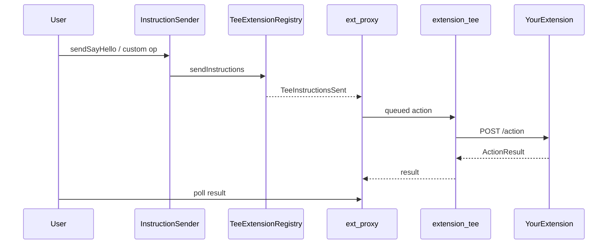

import Tabs from "@theme/Tabs";
import TabItem from "@theme/TabItem";
import CodeBlock from "@theme/CodeBlock";
import InstructionSender from "!!raw-loader!/examples/developer-hub-fcc-scaffold/contracts/InstructionSender.sol";
import ConfigGo from "!!raw-loader!/examples/developer-hub-fcc-scaffold/go/internal/config/config.go";
import ExtensionGo from "!!raw-loader!/examples/developer-hub-fcc-scaffold/go/internal/extension/extension.go";
import TypesGo from "!!raw-loader!/examples/developer-hub-fcc-scaffold/go/pkg/types/types.go";
import ConfigPython from "!!raw-loader!/examples/developer-hub-fcc-scaffold/python/app/config.py";
import HandlersPython from "!!raw-loader!/examples/developer-hub-fcc-scaffold/python/app/handlers.py";
import AbiPython from "!!raw-loader!/examples/developer-hub-fcc-scaffold/python/app/abi.py";
import ConfigTypescript from "!!raw-loader!/examples/developer-hub-fcc-scaffold/typescript/src/app/config.ts";
import HandlersTypescript from "!!raw-loader!/examples/developer-hub-fcc-scaffold/typescript/src/app/handlers.ts";
import AbiTypescript from "!!raw-loader!/examples/developer-hub-fcc-scaffold/typescript/src/app/abi.ts";

Build your first **Flare Confidential Compute (FCC)** extension from the Hello World scaffold example.
This guide walks you through the setup and testing flow, how extensions fit into the TEE stack, which files you customize, and how to deploy and test on **Coston2** testnet.

Find the scaffold example on [GitHub](https://github.com/flare-foundation/fce-extension-scaffold).
For background on FCC and Flare Compute Extensions (FCE), see the [FCC overview](/fcc/overview).

:::info[What you will build]
An HTTP server that runs inside a Trusted Execution Environment (TEE), in Go, Python, or TypeScript.
Onchain callers send instructions through your `InstructionSender` smart contract; the TEE infrastructure relays them to your extension's `POST /action` handler, and you return results that callers poll from the extension proxy.
:::

## Overview

The scaffold ships a working **GREETING** extension with two commands:

1. **`SAY_HELLO`** — JSON payload `{"name":"..."}`; returns a greeting string and increments a counter.
2. **`SAY_GOODBYE`** — ABI-encoded `(name, reason)`; returns a farewell string and increments a counter.

In this guide, you will:

1. Clone the scaffold.
2. Learn the instruction lifecycle and which files you own.
3. Deploy the Hello World smart contract and TEE stack against the Coston2 testnet.
4. Customize the OPType and OPCommand handlers and the onchain entry point for your own extension.

## How an Extension Works

An extension does not communicate directly with the chain.
A user (or another contract) calls your Solidity `InstructionSender` smart contract, which calls the `TeeExtensionRegistry.sendInstructions()` function.
Data providers relay the instruction; your local `ext-proxy` queues it; the TEE node delivers it to your extension.


```mermaid
sequenceDiagram
  participant User
  participant Sender as InstructionSender
  participant Registry as TeeExtensionRegistry
  participant Proxy as ext_proxy
  participant TEE as extension_tee
  participant Ext as YourExtension

  User->>Sender: sendSayHello / custom op
  Sender->>Registry: sendInstructions
  Registry-->>Proxy: TeeInstructionsSent
  Proxy->>TEE: queued action
  TEE->>Ext: POST /action
  Ext-->>TEE: ActionResult
  TEE-->>Proxy: result
  User->>Proxy: poll result
```

You control steps that start and end the flow: the onchain `InstructionSender` smart contract and the action handlers in your chosen language.
The TEE node and proxy handle attestation, signing, and message routing.

How those signatures work is split into two parts:

- [TEE public and private keys](/fcc/tee-keys) — how the machine signs results and decrypts secrets.
- [Data providers and cosigners](/fcc/data-providers) — who may send the TEE work.

## Architecture

The extension stack runs as three Docker services:

- **`extension-tee` TEE node:** TEE node plus your extension in Go, Python, or TypeScript (listens for `POST /action` and `GET /state`).
- **`ext-proxy` proxy server:** Watches Coston2 testnet for instructions targeting your extension, forwards them to the TEE, and exposes results and `/info` on the public proxy URL.
- **`redis` database:** In-memory store used by the proxy for queue and internal state.

## Clone the Scaffold Example

You need Docker, Foundry (`forge`, `cast`), and Go 1.25+ for the shared deploy tooling.
Python 3.11+ or Node 22+ is required only if you run those implementations.

Clone the scaffold example from GitHub:

```bash
git clone https://github.com/flare-foundation/fce-extension-scaffold.git
cd fce-extension-scaffold
```

The scaffold implements the same Hello World extension in Go, Python, and TypeScript.
This guide uses the Go default (`LANGUAGE=go`).
Pass `--language python` or `--language typescript` to `use-chain.sh` to switch implementations; the contract, scripts, and Coston2 flow stay the same.

## Hello World Onchain Smart Contract

The `HelloWorldInstructionSender` smart contract is the only onchain entry point for your operations, and it connects the rest of the flow.

It talks to:

- **`TeeExtensionRegistry`** — registers extensions and accepts `sendInstructions` calls that require a fee.
- **`TeeMachineRegistry`** — returns random TEE machine IDs for your extension via `getRandomTeeIds` function.

<details>
  <summary>View the code</summary>
  <CodeBlock language="solidity" title="contracts/InstructionSender.sol">
    {InstructionSender}
  </CodeBlock>
</details>

:::note
Constructor arguments are the two Flare system registry addresses.
On Coston2, they are already deployed; the deploy tooling reads them from `config/coston2/deployed-addresses.json`.
This is temporary while FCC is in development.
On release, addresses will be available through the [`FlareContractRegistry`](/network/guides/flare-contracts-registry) contract.
:::

## Customizing the Extension

The scaffold is a complete Hello World example.
The HTTP server and deploy scripts are ready to use.
Customize one language directory plus the Solidity contract so `OPType` and `OPCommand` strings stay aligned:

| Role                       | Go                                                              | Python                      | TypeScript                       |
| -------------------------- | --------------------------------------------------------------- | --------------------------- | -------------------------------- |
| OPType constants           | `go/internal/config/config.go`                                  | `python/app/config.py`      | `typescript/src/app/config.ts`   |
| Handlers                   | `go/internal/extension/extension.go`                            | `python/app/handlers.py`    | `typescript/src/app/handlers.ts` |
| Request and response types | `go/pkg/types/types.go`                                         | declared inline in handlers | declared inline in handlers      |
| ABI decoding               | `go/pkg/types/types.go`                                         | `python/app/abi.py`         | `typescript/src/app/abi.ts`      |
| Shared                     | `contracts/InstructionSender.sol`, `tools/cmd/run-test/main.go` | —                           | —                                |

:::info[Framework Layer]
Leave the framework layer intact: `go/internal/extension/utils.go` and `pkg/server/` in Go, `python/base/` in Python, and `typescript/src/base/` in TypeScript.
:::

### OPType and OPCommand Must Match

Solidity stores commands as `bytes32("...")`.
Each language hashes the same string constants and compares them with the incoming instruction.
The strings must be identical in the contract and in every implementation you run:

<Tabs groupId="language">
  <TabItem value="solidity" label="Solidity" default>

    ```solidity title="contracts/InstructionSender.sol"
    bytes32 constant OP_TYPE_GREETING       = bytes32("GREETING");
    bytes32 constant OP_COMMAND_SAY_HELLO   = bytes32("SAY_HELLO");
    bytes32 constant OP_COMMAND_SAY_GOODBYE = bytes32("SAY_GOODBYE");
    ```

  </TabItem>
  <TabItem value="go" label="Go">

    ```go title="go/internal/config/config.go"
    const (
        OPTypeGreeting      = "GREETING"
        OPCommandSayHello   = "SAY_HELLO"
        OPCommandSayGoodbye = "SAY_GOODBYE"
    )
    ```

  </TabItem>
  <TabItem value="python" label="Python">

    ```python title="python/app/config.py"
    OP_TYPE_GREETING = "GREETING"
    OP_COMMAND_SAY_HELLO = "SAY_HELLO"
    OP_COMMAND_SAY_GOODBYE = "SAY_GOODBYE"
    ```

  </TabItem>
  <TabItem value="typescript" label="TypeScript">

    ```ts title="typescript/src/app/config.ts"
    export const OP_TYPE_GREETING = "GREETING";
    export const OP_COMMAND_SAY_HELLO = "SAY_HELLO";
    export const OP_COMMAND_SAY_GOODBYE = "SAY_GOODBYE";
    ```

  </TabItem>
</Tabs>

Then the handler in your chosen language should match:

```go title="go/internal/extension/extension.go"
case dataFixed.OPType == teeutils.ToHash(config.OPTypeGreeting):
    // then sub-route on OPCommand
```

:::warning

Mismatch of the `OPType` or `OPCommand` strings is the most common cause of `unsupported op type` / `unsupported op command` responses.

`OPType` strings beginning with `F_` are reserved for Flare system operations, so do not use that prefix for your own extension.

:::

### Config Constants

Increment `Version` when behavior or the onchain interface changes, because the TEE registration path treats code version as part of the extension lifecycle.

<Tabs groupId="language">
  <TabItem value="go" label="Go" default>

    <CodeBlock language="go" title="go/internal/config/config.go">
      {ConfigGo}
    </CodeBlock>

  </TabItem>
  <TabItem value="python" label="Python">

    <CodeBlock language="python" title="python/app/config.py">
      {ConfigPython}
    </CodeBlock>

  </TabItem>
  <TabItem value="typescript" label="TypeScript">

    <CodeBlock language="ts" title="typescript/src/app/config.ts">
      {ConfigTypescript}
    </CodeBlock>

  </TabItem>
</Tabs>

### Request and Response Types

The `SAY_HELLO` command uses JSON in `OriginalMessage`.
The `SAY_GOODBYE` command uses ABI encoding so the contract can accept typed `string` arguments and `abi.encode` them for the TEE.

Go keeps those shapes in `pkg/types/types.go`.
Python and TypeScript declare JSON request and response dicts inline in the handlers, and decode the ABI payload in a dedicated module.

<Tabs groupId="language">
  <TabItem value="go" label="Go" default>

    <CodeBlock language="go" title="go/pkg/types/types.go">
      {TypesGo}
    </CodeBlock>

  </TabItem>
  <TabItem value="python" label="Python">

    <CodeBlock language="python" title="python/app/abi.py">
      {AbiPython}
    </CodeBlock>

  </TabItem>
  <TabItem value="typescript" label="TypeScript">

    <CodeBlock language="ts" title="typescript/src/app/abi.ts">
      {AbiTypescript}
    </CodeBlock>

  </TabItem>
</Tabs>

### Handlers

Each handler follows the same pattern: decode, validate, execute, then return a result.
Protect shared state with a mutex in Go; the Python and TypeScript frameworks serialize handler calls, so module-level state is safe.

Status values in `ActionResult`:

- **`0`** — error (message in `Log`)
- **`1`** — success
- **`≥ 2`** — pending (async work; later POST final result to the node)

<Tabs groupId="language">
  <TabItem value="go" label="Go" default>

    <CodeBlock language="go" title="go/internal/extension/extension.go">
      {ExtensionGo}
    </CodeBlock>

    Leave `New()` and the HTTP wiring in place.
    Add your own OPType cases in `processAction`, then implement command handlers next to `processSayHello` / `processSayGoodbye`.

  </TabItem>
  <TabItem value="python" label="Python">

    <CodeBlock language="python" title="python/app/handlers.py">
      {HandlersPython}
    </CodeBlock>

    Wire new commands in `register()`, then implement handlers next to `handle_say_hello` / `handle_say_goodbye`.
    Do not modify `python/base/`.

  </TabItem>
  <TabItem value="typescript" label="TypeScript">

    <CodeBlock language="ts" title="typescript/src/app/handlers.ts">
      {HandlersTypescript}
    </CodeBlock>

    Wire new commands in `register()`, then implement handlers next to `handleSayHello` / `handleSayGoodbye`.
    Do not modify `typescript/src/base/`.

  </TabItem>
</Tabs>

## Deploying and Testing on Coston2

This walkthrough runs a local simulated TEE against the live Coston2 chain (chain ID `114`) using Docker.
`start-services.sh` starts a Cloudflare tunnel to host port **6674** and writes `EXT_PROXY_URL` for you.

You need a funded Coston2 account for gas and registration fees — use the [Coston2 faucet](https://faucet.flare.network/coston2).

:::tip[Quick start]
After Steps 1-3 (`use-chain.sh`, deployer keys, and indexer credentials), run the rest of the lifecycle in one shot:

```bash
./scripts/full-setup.sh --chain coston2 --test
```

Or run the same phases individually:

```bash
./scripts/pre-build.sh
./scripts/start-services.sh --chain coston2
./scripts/post-build.sh
./scripts/test.sh
```

:::

### Step 1: Activate simulated Coston2

```bash
./scripts/use-chain.sh coston2 --simulated
```

This creates `.env.coston2` and `.env.local.coston2`, generates the Coston2 proxy TOML and Compose overlay, and copies the simulated file to `.env`.
It sets `CHAIN`, `CHAIN_ID=114`, `CHAIN_URL`, `ADDRESSES_FILE`, `LOCAL_MODE=false`, `SIMULATED_TEE=true`, and `NORMAL_PROXY_URL` for you.

Pass `--language python` or `--language typescript` to select a non-Go image.
Edit `.env.local.coston2`, never `.env` — `.env` is a disposable copy that `use-chain.sh` overwrites.

### Step 2: Configure deployer keys

Edit `.env.local.coston2` and set your funded Coston2 credentials:

```bash title=".env.local.coston2"
DEPLOYMENT_PRIVATE_KEY="<your-funded-coston2-private-key-hex-no-0x>"
INITIAL_OWNER="0x<your-address>"
```

Optionally set TEE governance (used by the node container and by `post-build`):

```bash title=".env.local.coston2"
# GOVERNANCE_SIGNERS="0xAbc...,0xDef..."   # comma-separated 0x addresses
# GOVERNANCE_THRESHOLD=2
```

If unset, both default to the deployer (`INITIAL_OWNER`) as the sole signer with threshold `1` — fine for Hello World.
The node and onchain registry must agree on this set, or TEE registration reverts with `InvalidGovernanceHash`.

Re-activate after editing so `.env` picks up the changes:

```bash
./scripts/use-chain.sh coston2 --simulated
```

### Step 3: Configure the indexer database

The local `ext-proxy` queries Flare's C-chain indexer for TEE events.
`use-chain.sh` already generated `config/proxy/extension_proxy.coston2.docker.toml`.
Edit the `[db]` block with the Coston2 indexer host and the read-only credentials provided to you:

```toml title="config/proxy/extension_proxy.coston2.docker.toml"
[db]
host = "34.38.42.208"
port = 3306
database = "indexer"
username = "<your-indexer-db-username>"
password = "<your-indexer-db-password>"
log_queries = false
```

Chain ID `114` and the Coston2 Flare system contract addresses are already set in the generated file.

:::info[Flare Indexer Access]
To get indexer credentials, contact [support](https://flare.network/resources/technical-support) or [X](https://x.com/FlareDevs) and share what you are building.
:::

### Step 4: Deploy the contract and register the extension

```bash
./scripts/pre-build.sh
```

This compiles Solidity, deploys the `HelloWorldInstructionSender` smart contract, and registers the extension on the `TeeExtensionRegistry` registry contract.
On success, it writes the `EXTENSION_ID` and `INSTRUCTION_SENDER` to the `config/coston2/extension.env` file.

:::warning
Once the `config/coston2/extension.env` file exists, pre-build refuses to run again.
Use `./scripts/pre-build.sh --force` only when you intentionally want a new extension.
Forcing a new pre-build deploys a new sender and registers a new extension ID, while your existing TEE machine may still be tied to the old ID — end-to-end tests then fail with mismatches such as `MachineManager.TooMany()`.
:::

### Step 5: Start the extension stack

```bash
./scripts/start-services.sh --chain coston2
```

Because `SIMULATED_TEE=true`, this starts a Cloudflare tunnel to host port **6674**, writes `EXT_PROXY_URL` into `.env` and `.env.local.coston2`, then waits until the public proxy answers `/info`.

:::warning[Security — read before exposing port 6674]
Exposing port **6674** makes your local **ext-proxy** reachable over HTTPS.
Anyone with the tunnel URL can call the proxy HTTP API.

Use a tunnel **only for Coston2 testnet**, and stop it when finished with `./scripts/stop-services.sh --chain coston2`.
:::

To use ngrok instead of the bundled tunnel, start `ngrok http 6674` first, set `EXT_PROXY_URL` in `.env.local.coston2`, re-run `use-chain.sh`, then start services.

Confirm the public URL:

```bash
source .env
curl -sf "$EXT_PROXY_URL/info" | jq .
```

Quick tunnels mint a new hostname on each restart.
If the URL changes after the TEE is registered, run `./scripts/update-tee-url.sh` so the onchain machine record matches.

### Step 6: Verify the proxy

```bash
source .env
curl -s "$EXT_PROXY_URL/info" | jq '.machineData'
```

For a simulated TEE, expect:

| Field          | Expected                                                 |
| -------------- | -------------------------------------------------------- |
| `codeHash`     | Simulated hash (`0x194844cf…`)                           |
| `extensionId`  | Matches `EXTENSION_ID` in `config/coston2/extension.env` |
| `initialOwner` | Matches your `INITIAL_OWNER`                             |

### Step 7: Register the TEE machine

```bash
./scripts/post-build.sh
```

This allows your TEE code version for the extension, registers the extension's TEE **governance** onchain (`set-governance`, using `GOVERNANCE_SIGNERS` / `GOVERNANCE_THRESHOLD` from `.env` or the deployer defaults), then registers the TEE machine (using `EXT_PROXY_URL` and `NORMAL_PROXY_URL` from `.env`).

### Step 8: Run the end-to-end test

```bash
./scripts/test.sh
```

The test calls `setExtensionId()` if needed, sends `SAY_HELLO` and `SAY_GOODBYE` instructions through the deployed contract, polls the proxy for `ActionResult`s, and asserts the greeting/farewell payloads.

If it passes, your Hello World extension is live against Coston2.

## Making It Your Own

1. Choose OPType/OPCommand names that describe your operations, avoiding the reserved `F_` OPType prefix.
2. Update Solidity constants and send functions; regenerate Go bindings if you change the ABI (`./scripts/generate-bindings.sh`).
3. Implement handlers and types in the language you selected.
4. Update `tools/cmd/run-test/main.go` and re-run `./scripts/test.sh`.
5. Rebuild the TEE image after code changes: `./scripts/start-services.sh --chain coston2` (compose uses `--build`).

The scaffold README file covers renaming placeholders (`docs/manual-setup.md`).
Hooks `scripts/extension-setup.sh` and `scripts/extension-post-setup.sh` are no-ops in Hello World — add deploy-time or post-registration setup there when your extension needs it.

Stop the stack with `./scripts/stop-services.sh --chain coston2`.
If a quick-tunnel URL rotated after registration, run `./scripts/update-tee-url.sh` instead of re-registering the machine.

## Troubleshooting

| Symptom                                              | What to check                                                                                                                                                      |
| ---------------------------------------------------- | ------------------------------------------------------------------------------------------------------------------------------------------------------------------ |
| `unsupported op type` / `unsupported op command`     | Solidity `bytes32("...")` strings must match the config constants in your language implementation exactly.                                                         |
| `docker-compose.coston2.yaml not found`              | Run `./scripts/use-chain.sh coston2 --simulated` first.                                                                                                            |
| Edits in `.env` have no effect                       | Edit `.env.local.coston2`, then re-run `./scripts/use-chain.sh coston2 --simulated`.                                                                               |
| `signature must be 65 bytes, got 0`                  | `CHAIN_ID` is unset on the node — `use-chain.sh` sets it to `114` for Coston2.                                                                                     |
| Proxy never becomes ready                            | Tunnel to **6674**, indexer `[db]` credentials, and `docker compose` logs for `ext-proxy`.                                                                         |
| Pre-build refuses to run                             | `config/coston2/extension.env` already exists — use `--force` only if you intend a new extension ID.                                                               |
| `MachineManager.TooMany()` or wrong extension        | Extension ID in `config/coston2/extension.env` does not match the TEE registered by post-build — avoid casual `--force`.                                           |
| `pollAction` timeout / `/action/result` 404          | Stale tunnel URL or extra active TEE machines — run `./scripts/update-tee-url.sh` and `./scripts/check-tee-machines.sh --chain coston2`.                           |
| `InvalidGovernanceHash`                              | `GOVERNANCE_SIGNERS` / `GOVERNANCE_THRESHOLD` in `.env.local.coston2` must match what the `extension-tee` container received; rebuild/restart after changing them. |
| Attestation / registration failures                  | Confirm `LOCAL_MODE=false`, `SIMULATED_TEE=true`, and `NORMAL_PROXY_URL=https://tee-proxy-coston2-1.flare.rocks`.                                                  |
| Docker build fails fetching `tee-node` / `tee-proxy` | Confirm network access so Go can fetch the pinned `tee-node` module and Docker can build from `proxy/Dockerfile`.                                                  |

For issues that are not specific to this walkthrough, such as a TEE machine that never reaches production, a proxy that rejects TEE signatures, or instructions that never reach your extension, see [FCC Troubleshooting](/fcc/troubleshooting).
