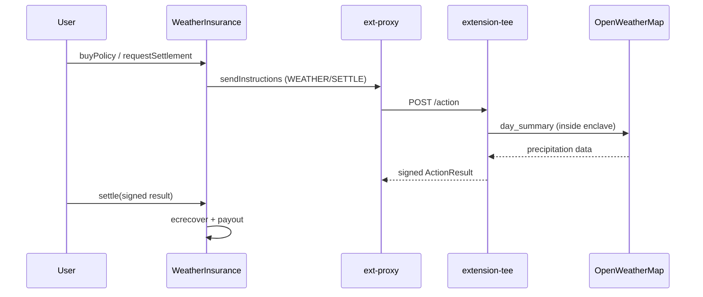

import CodeBlock from "@theme/CodeBlock";
import WeatherInsurance from "!!raw-loader!/examples/developer-hub-fcc-weather-insurance/contracts/WeatherInsurance.sol";

Build and deploy a **Trusted Execution Environment (TEE) extension** that settles **parametric rainfall insurance** using weather data from [OpenWeatherMap](https://openweathermap.org/api) inside a secure enclave.
This guide walks through every step — from writing the smart contract and extension handler to deploying on Coston2 and running an end-to-end policy buy and settlement test.
The code for this example is available on [GitHub](https://github.com/flare-foundation/fce-weather-insurance).

:::info[New to Flare TEE?]
A TEE extension is an off-chain program that runs inside a Trusted Execution Environment.
It receives **instructions** from on-chain transactions, processes them in a secure enclave, and writes the signed results back to the blockchain.
The TEE framework handles attestation, key management, and message routing — you only write the business logic.
:::

## Overview

The Weather Insurance extension demonstrates a full [Flare Confidential Compute (FCC)](/fcc/overview) application workflow:

1. A policyholder buys rainfall cover for a specific date and location, paying a premium in an ERC-20 token.
2. After midnight on the day following the coverage date, a keeper sends a `SETTLE` instruction to the extension.
3. The extension fetches that day's precipitation from the OpenWeatherMap API inside the enclave.
4. The extension signs the settlement result; anyone calls `settle()` on-chain to verify the TEE signature and pay out if the rainfall threshold was met.

The extension also supports:

- **`FETCH`** — ad-hoc current weather for a city (useful for testing).
- **`BUY`** — private policy purchase where coverage terms are [ECIES](https://en.wikipedia.org/wiki/Integrated_Encryption_Scheme)-encrypted and only decrypted inside the TEE.

We will build this in three parts:

1. **on-chain contract** (`WeatherInsurance`) that manages policies and routes instructions;
2. **off-chain handler** (Go) that calls the OpenWeatherMap API and signs results;
3. **deployment tooling** that ties everything together.

## Architecture

The extension stack consists of three components running as Docker services:

- **`extension-tee`:** Your extension code (Go).
  Receives decoded instructions from the proxy, calls the OpenWeatherMap API, and returns signed results.
- **`ext-proxy`:** The TEE extension proxy.
  Watches the chain for new instructions targeting your extension, forwards them to your handler, and submits results back on-chain.
- **`redis`:** In-memory store used by the proxy for internal state.



## Onchain Contract

The `WeatherInsurance` smart contract is the onchain entry point.

It interacts with two Flare system contracts:

- **`TeeExtensionRegistry`:** Registers extensions and routes instructions to TEE machines.
- **`TeeMachineRegistry`:** Tracks registered TEE machines and provides random selection.

The contract also manages policy state, ERC-20 premiums and payouts, and on-chain verification of signatures.

<details>
  <summary>Contract Code</summary>
  <CodeBlock language="solidity" title="contracts/WeatherInsurance.sol">
    {WeatherInsurance}
  </CodeBlock>
</details>

:::note
The constructor takes the addresses of the two Flare system contracts.
These are already deployed on Coston2 — the deployment tooling reads their addresses from `config/coston2/deployed-addresses.json`.
This is a temporary solution, because Flare Confidential Compute is still in development.
On release, both addresses will be available through the [`FlareContractRegistry`](/network/guides/flare-contracts-registry) contract.
:::

### Operation Identifiers

Constants must match `internal/config/config.go`:

```solidity title="contracts/WeatherInsurance.sol"
bytes32 public constant OP_TYPE_WEATHER = bytes32("WEATHER");
bytes32 public constant OP_COMMAND_FETCH  = bytes32("FETCH");
bytes32 public constant OP_COMMAND_SETTLE = bytes32("SETTLE");
bytes32 public constant OP_COMMAND_BUY    = bytes32("BUY");
```

| Command  | Purpose                                                                      |
| -------- | ---------------------------------------------------------------------------- |
| `FETCH`  | Return current weather JSON for a city (testing and dApp display).           |
| `SETTLE` | Fetch daily rainfall for a policy and return a signed settlement payload.    |
| `BUY`    | Decrypt ECIES-encrypted private policy terms and return attested parameters. |

### Policy Lifecycle

A `Policy` struct stores coverage metadata on-chain:

```solidity title="contracts/WeatherInsurance.sol"
struct Policy {
    address policyholder;
    string date;                // "YYYY-MM-DD"
    uint256 rainThresholdMmE2;  // trigger threshold in mm x 100
    uint256 payout;
    uint256 premium;
    uint256 measuredMmE2;       // set on settle
    bool settled;
    bool paidOut;
    bool isPrivate;             // threshold held in TEE until settlement
    bytes32 termsCommitment;
    string lat;
    string lon;
    uint64 settlementUnlockAt;  // 00:00 UTC day after coverage date
}
```

Settlement unlock time is computed by the `SettlementTime` library — the earliest `requestSettlement` / `settle` call is midnight on the day after the coverage date.

### Buying a Policy

**Public buy** — all terms are visible on-chain:

```solidity title="contracts/WeatherInsurance.sol"
function buyPolicy(
    string calldata _date,
    uint256 _rainThresholdMmE2,
    uint256 _payout,
    uint256 _premium,
    string calldata _lat,
    string calldata _lon
) external returns (uint256 policyId)
```

The caller must `approve` the contract for `_premium` in `payToken` before calling.
The contract pulls the premium, reserves `_payout` from pool liquidity, and records the policy.

**Private buy** — coverage terms stay encrypted on-chain:

1. The buyer ECIES-encrypts ABI-encoded `PrivateBuyParams` with the Flare Confidential Compute extension public key.
2. The `buyPolicyPrivate` function sends the ciphertext as a `WEATHER` / `BUY` instruction.
3. After the extension processes the instruction, the buyer calls `relayPrivateBuy` with the signed result.
4. The contract verifies the TEE signature via `ecrecover` against `teeAddress` and creates the policy.

### Settlement Flow

From `settlementUnlockAt` onward, a keeper triggers settlement:

```solidity title="contracts/WeatherInsurance.sol"
function requestSettlement(uint256 _policyId) external payable {
    // ...
    bytes memory message = abi.encode(SettleMessage({
        policyId: _policyId,
        contractAddr: address(this),
        date: p.date,
        lat: p.lat,
        lon: p.lon,
        termsCommitment: p.termsCommitment
    }));
    // sendInstructions with opCommand = SETTLE
}
```

Anyone can then call `settle()` with the TEE-signed `ActionResult` that is returned by the extension.
The contract reconstructs `ActionResult.Hash()`, recovers the signer, and requires that the signer equal the registered `teeAddress`.
If measured precipitation meets the threshold, `payToken` is transferred to the policyholder.

### TEE Signature Verification

Both `relayPrivateBuy` and `settle` verify TEE results using the same pattern:

```solidity
bytes32 resultHash = keccak256(
    abi.encodePacked(
        keccak256(_resultData),
        _actionId,
        keccak256(bytes(_submissionTag)),
        _status
    )
);
address signer = _recover(_ethSigned(resultHash), _signature);
require(signer == teeAddress, "bad TEE signature");
```

The TEE node signs `ActionResult.Hash()` with the [EIP-191 personal-sign](https://eips.ethereum.org/EIPS/eip-191) prefix.
Only successful results are accepted.

### Extension ID Discovery

After the extension is registered on-chain, call `setExtensionId()` once to discover and cache the extension ID — same pattern as the [Private Key Extension](/fcc/guides/sign-extension).

## Off-chain Handler

The off-chain handler lives in `internal/extension/`.
It exposes an HTTP server with two endpoints:

- **`GET /state`** — reports whether the OpenWeatherMap API key is configured.
- **`POST /action`** — receives TEE actions and routes them by `opType` / `opCommand`.

Constants match the Solidity contract:

```go title="internal/config/config.go"
const (
    OPTypeWeather   = "WEATHER"
    OPCommandFetch  = "FETCH"
    OPCommandSettle = "SETTLE"
    OPCommandBuy    = "BUY"
)
```

### FETCH Handler

The `processWeatherFetch` function ABI-decodes a city name, calls the OpenWeatherMap API, and returns a JSON `WeatherReport` in `ActionResult.Data`:

```go title="internal/extension/extension.go"
func (e *Extension) processWeatherFetch(action teetypes.Action, df *instruction.DataFixed) teetypes.ActionResult {
    req, err := structs.Decode[types.GetWeatherRequest](types.GetWeatherMessageArg, df.OriginalMessage)
    // ...
    report, err := fetchWeather(req.City)
    payload, err := json.Marshal(report)
    return buildResult(action, df, payload, 1, nil)
}
```

### SETTLE Handler

The `processWeatherSettle` function fetches daily precipitation from the OpenWeatherMap API and ABI-encodes the settlement:

```go title="internal/extension/extension.go"
encoded, err := types.SettlementResultArgs.Pack(
    req.ContractAddr,
    req.PolicyId,
    precipMmE2,
    coverageDate,
    revealedThreshold,
    triggered,
)
return buildResult(action, df, encoded, 1, nil)
```

For private policies, the handler loads coverage terms from in-enclave memory using `termsCommitment` as the key.

### BUY Handler

The `processWeatherBuy` function decrypts ECIES ciphertext via the TEE node's `/decrypt` endpoint, validates `PrivateBuyParams`, stores terms in memory, and returns ABI-encoded parameters for `relayPrivateBuy`:

```go title="internal/extension/extension.go"
plaintext, err := decryptViaNode(e.signPort, df.OriginalMessage)
params, err := structs.Decode[types.PrivateBuyParams](types.PrivateBuyParamsArg, plaintext)
// ...
e.privateTerms[commitment] = params
encoded, err := types.PrivateBuyResultArgs.Pack(params.Holder, params.ContractAddr, ...)
return buildResult(action, df, encoded, 1, nil)
```

## Deploying and Testing on Coston2

This walkthrough deploys a **local simulated TEE** against the real Coston2 chain using Docker and an `ngrok` tunnel.
For production deployment on a Google Cloud Platform Confidential Space VM, see `DEPLOYMENT_STEPS.md` in the repository.

### Step 0: Activate local simulated mode

```bash
./scripts/use-chain.sh local coston2
```

This copies `.env.local.coston2` to `.env`, setting `SIMULATED_TEE=true` and `LOCAL_MODE=false`.

### Step 1: Configure deployer keys and API key

Edit `.env.local.coston2` and set your funded Coston2 credentials and OpenWeatherMap key:

```bash title=".env.local.coston2"
DEPLOYMENT_PRIVATE_KEY="<your-funded-coston2-private-key-hex-no-0x>"
INITIAL_OWNER="0x<your-address>"
OPENWEATHERMAP_API_KEY="<your-openweathermap-api-key>"
PAY_TOKEN="0x53192e788991AD96bC180249B15AefB94E597dD1"
```

The `PAY_TOKEN` variable is the address of a mocked [ERC-20](https://eips.ethereum.org/EIPS/eip-20) token on Coston2 — used for premiums and payouts during testing.
You can use this token for testing purposes or deploy your own ERC-20 token.

Re-activate after editing:

```bash
./scripts/use-chain.sh local coston2
```

### Step 2: Deploy contract and register extension

```bash
./scripts/pre-build.sh
./scripts/extension-setup.sh
```

The `pre-build.sh` script compiles Solidity, deploys `WeatherInsurance`, and registers the extension on-chain.
It writes `EXTENSION_ID` and `INSTRUCTION_SENDER` to `config/extension.env`.

The `extension-setup.sh` script calls `setPayToken` on the deployed contract.

:::warning
Once `config/extension.env` exists, the pre-build step refuses to run again.
Use `./scripts/pre-build.sh --force` only when you intentionally want a new extension.
:::

### Step 3: Start the ngrok tunnel

In a separate terminal:

```bash
ngrok http 6674
```

Copy the HTTPS URL and set it in `.env.local.coston2`:

```bash title=".env.local.coston2"
EXT_PROXY_URL="https://<your-ngrok-domain>"
```

Re-activate:

```bash
./scripts/use-chain.sh local coston2
```

### Step 4: Configure the indexer database

```bash
cp config/proxy/extension_proxy.coston2.docker.toml.example \
   config/proxy/extension_proxy.coston2.docker.toml
```

Edit the `[db]` block with Coston2 indexer credentials — same process as the [Private Key Extension](/fcc/guides/sign-extension#step-4-configure-the-indexer-database).

:::info[Flare Indexer Access]
To get the indexer credentials, please get in touch with us via [support](https://flare.network/resources/technical-support) or [X](https://x.com/FlareDevs) and share what you are building.
:::

### Step 5: Start the extension stack

```bash
./scripts/start-services.sh
```

Wait for the proxy to become healthy:

```bash
until curl -sf http://localhost:6674/info >/dev/null 2>&1; do sleep 2; done
echo "Extension proxy is ready"
```

### Step 6: Verify the proxy

```bash
curl -s "$EXT_PROXY_URL/info" | jq '.machineData'
```

For a simulated TEE, expect the same `codeHash` and `extensionId` pattern as the sign extension.

### Step 7: Register the TEE machine

```bash
./scripts/post-build.sh
./scripts/extension-post-setup.sh
```

The `post-build.sh` script allows the TEE version and registers the machine.

The `extension-post-setup.sh` script reads the TEE signing address from the proxy and calls `setTeeAddress` on the `WeatherInsurance` contract.

### Step 8: Run the end-to-end test

```bash
./scripts/test.sh
```

The test does the following:

1. Funds the payout pool with WPT.
2. Buys a private policy (ECIES-encrypted terms).
3. Relays the TEE-signed buy result via the `relayPrivateBuy` function on the contract.
4. Requests settlement and waits for the TEE to fetch OpenWeatherMap data.
5. Calls the `settle` function on the contract with the signed result and verifies the payout.

If the test passes, your extension is fully operational.

## Web Frontend (Optional)

The repository includes a Next.js dApp in the `frontend/` directory for wallet connect, policy purchase (public or private), settlement, and live weather fetch.

After the extension stack is running and `config/extension.env` exists:

```bash
cp frontend/.env.local.example frontend/.env.local
# Set NEXT_PUBLIC_WEATHER_INSURANCE from INSTRUCTION_SENDER in config/extension.env
# Set EXT_PROXY_URL to http://127.0.0.1:6674 for local UI

cd frontend && npm install && npm run dev
```

Open the application in your browser, connect MetaMask on **Coston2** (chain ID 114), and fund **C2FLR** and the mocked ERC-20 token for premiums and payouts.

The UI proxies TEE `/info` and `/action/result` through Next.js API routes to avoid browser CORS issues.

## Troubleshooting

**`OPENWEATHERMAP_API_KEY is not set` in TEE logs**

Set the key in `.env` and re-run `start-services.sh`.

**Proxy won't start or DB sync error**

Check the proxy logs and verify DB credentials in `config/proxy/extension_proxy.coston2.docker.toml`:

```bash
docker compose logs ext-proxy
```

**`MachineManager.TooMany()` during test**

The extension ID in `config/extension.env` does not match the on-chain TEE record.
Run a [full reset](#cleanup) and start again, or keep the existing `config/extension.env` and re-run `post-build.sh` and `test.sh`.

**`bad TEE signature` on settle or relay**

Confirm `extension-post-setup.sh` ran successfully and `teeAddress` on the contract matches the registered TEE machine.

**`Verification.ChallengeExpired`**

Re-run `post-build.sh`.

**`ngrok` URL changed**

1. Update `EXT_PROXY_URL` in `.env.local.coston2` and re-run `use-chain.sh`.
2. Restart the Docker stack: `./scripts/stop-services.sh && ./scripts/start-services.sh`.
3. Re-run `post-build.sh`, `extension-post-setup.sh`, and `test.sh`.

## Cleanup

**Stop the Docker stack**

```bash
./scripts/stop-services.sh
```

**Full reset**

```bash
./scripts/stop-services.sh
docker compose down --rmi local
rm -f .env config/extension.env config/proxy/extension_proxy.coston2.docker.toml
```

After a full reset, start again from [Step 0](#step-0-activate-local-simulated-mode).

:::info[What's next?]
Read the [Flare Confidential Compute (FCC) overview](/fcc/overview) for more information on how to build and deploy TEE extensions on Flare.
Compare with the [Private Key Extension](/fcc/guides/sign-extension) for a simpler introduction to the instruction routing pattern.
:::
