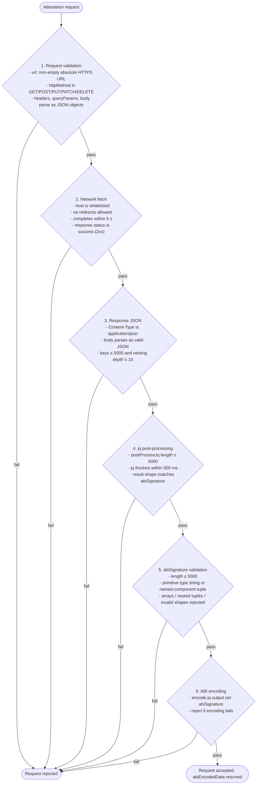

An attestation type that fetches JSON data from the given URL, applies a jq filter to transform the returned result, and finally returns the structured data as ABI encoded data.

**Supported sources:** [Mainnet](https://github.com/flare-foundation/verifier-indexer-api/blob/main/src/config/web2/web2-json-sources.ts), [Testnet](https://github.com/flare-foundation/verifier-indexer-api/blob/main/src/config/web2/web2-json-test-sources.ts)

## Request body

| Field           | Solidity type | Description                                                                                                                                         |
| --------------- | ------------- | --------------------------------------------------------------------------------------------------------------------------------------------------- |
| `url`           | `string`      | URL of the data source.                                                                                                                             |
| `httpMethod`    | `string`      | HTTP method to be used for the request. Supported methods: GET, POST, PUT, PATCH, DELETE.                                                           |
| `headers`       | `string`      | Stringified key-value pairs representing headers to be used in the request. Use `{}` if no headers are required.                                    |
| `queryParams`   | `string`      | Stringified key-value pairs representing query parameters to be appended to the URL of the request. Use `{}` if no query parameters are required.   |
| `body`          | `string`      | Stringified key-value pairs representing the body to be used in the request. Use `{}` if the body is not required.                                  |
| `postProcessJq` | `string`      | [jq](https://jqlang.org/manual/) filter used to post-process the JSON response from the URL.                                                        |
| `abiSignature`  | `string`      | ABI signature specifier: either a primitive type string (e.g., "uint256") or a JSON tuple descriptor with named `components` describing the fields. |

:::warning

The `Web2Json` attestation consumers should validate all request fields.
Since `postProcessJq` and `abiSignature` parameters can modify and rearrange the fetched JSON data, a malicious request could completely change the API endpoint response.

:::

## Response body

| Field            | Solidity type | Description                                                      |
| ---------------- | ------------- | ---------------------------------------------------------------- |
| `abiEncodedData` | `bytes`       | Raw binary data encoded to match the function parameters in ABI. |

## Supported jq features

Only a restricted subset of `jq` is supported for the `postProcessJq` filter to ensure security and performance:

|              Feature | Allowed syntax / examples                                                                                                                                                                                                                                                                                                   |
| -------------------: | :-------------------------------------------------------------------------------------------------------------------------------------------------------------------------------------------------------------------------------------------------------------------------------------------------------------------------- |
|      Builtin filters | `map`, `select`, `flatten`, `length`, `keys`, `to_entries`, `from_entries`, `has`, `contains`, `add`, `join`, `tonumber`, `tostring`, `split`, `gsub`, `match`, `type`, `startswith`, `endswith`, `test`, `explode`, `implode`, `ascii_upcase`, `ascii_downcase`, `sort`, `sort_by`, `reverse`, `first`, `last`, `not`, `.` |
|            Operators | `\|`, `,`, `//`, `and`, `or`, `==`, `!=`, `<`, `>`, `<=`, `>=`, `+`, `-`, `*`, `/`, `%`                                                                                                                                                                                                                                     |
|             Identity | `.` or `.field`                                                                                                                                                                                                                                                                                                             |
|         Conditionals | `if <cond> then <expr> elif <cond2> then <expr2> else <expr3> end`                                                                                                                                                                                                                                                          |
|            Try/catch | `try <expr> catch <handler>`                                                                                                                                                                                                                                                                                                |
|     Indexing/slicing | `.arr[0]`, `.posts[0:10]`, `.obj["key"]`                                                                                                                                                                                                                                                                                    |
|            Iteration | `.items[] \| .id`                                                                                                                                                                                                                                                                                                           |
|       Arrays/objects | `[expr, expr]`, `{id: .id, name: .name}`                                                                                                                                                                                                                                                                                    |
| Strings with interp. | `"Hello \(.name)"`                                                                                                                                                                                                                                                                                                          |
|   Variables (scoped) | `(.a as $x \| $x + 1)`                                                                                                                                                                                                                                                                                                      |

### Allowed jq filter examples

```jq
.
.items | map(.id)
map(select(.active == true)) | length
.to_entries | from_entries
.text | gsub("foo"; "bar") | ascii_upcase
```

### Disallowed jq filter examples

```jq
def add(a; b): a + b;         # user function definitions
.foo = 1                      # assignment/update operators (e.g. =, |=)
recurse(.)                    # unbounded recursion
reduce .[] as $x (0; . + $x)  # reduce
inputs                        # streaming side-effect
```

## Request examples

### 1. Retrieve `id` & `title` of the last Todo item

Request body:

```json
{
  "url": "https://jsonplaceholder.typicode.com/todos",
  "httpMethod": "GET",
  "headers": "{}",
  "queryParams": "{}",
  "body": "{}",
  "postProcessJq": ".[-1] | { id: .id, title: .title }",
  "abiSignature": {
    "type": "tuple",
    "components": [
      {
        "name": "id",
        "type": "uint256"
      },
      {
        "name": "title",
        "type": "string"
      }
    ]
  }
}
```

Response body:

```json
{
  "abiEncodedData": "0x000000000000000000000000000000000000000000000000000000000000002000000000000000000000000000000000000000000000000000000000000000c80000000000000000000000000000000000000000000000000000000000000040000000000000000000000000000000000000000000000000000000000000001c697073616d206170657269616d20766f6c757074617465732071756900000000"
}
```

### 2. Verify the first Todo item is `completed`

Request body:

```json
{
  "url": "https://jsonplaceholder.typicode.com/todos/1",
  "httpMethod": "GET",
  "headers": "{}",
  "queryParams": "{}",
  "body": "{}",
  "postProcessJq": ".completed",
  "abiSignature": "bool"
}
```

Response body:

```json
{
  "abiEncodedData": "0x0000000000000000000000000000000000000000000000000000000000000000"
}
```

## Lowest Used Timestamp

For `lowestUsedTimestamp`, `0xffffffffffffffff` ($2^{64}-1$ in hex) is used.

## Verification

The request is accepted only if all the following checks pass:

1. Request validation:
   - `url` is a non-empty absolute HTTPS URL.
   - `httpMethod` is one of: GET, POST, PUT, PATCH, DELETE.
   - `headers`, `queryParams`, and `body` are valid JSON objects when parsed from their string form.
2. Network fetch constraints:
   - Target host must be whitelisted.
   - Any attempt to redirect results in rejection.
   - End-to-end HTTP request completes within 5 seconds.
   - HTTP response status indicates success (e.g., 2xx).
3. Response JSON constraints:
   - `Content-Type` is `application/json`.
   - Body parses as valid JSON.
   - Structural limits: total keys ≤ 5000 and maximum JSON nesting depth ≤ 10.
4. jq post-processing:
   - `postProcessJq` length ≤ 5000 characters.
   - jq evaluation finishes within 500 milliseconds.
   - Shape/type compatibility:
     - If `abiSignature` is a primitive type string, the jq result MUST be a single scalar compatible with that type.
     - If `abiSignature` is a tuple JSON with named `components`, the jq result MUST be a JSON object containing all component names as keys.
5. ABI signature constraints:
   - `abiSignature` length ≤ 5000 characters.
   - `abiSignature` is either:
     - a primitive Solidity type string (e.g., `"uint256"`, `"bool"`, `"string"`, etc.), or
     - a JSON-encoded tuple descriptor with named `components` (no arrays or nested tuples supported).
   - Any other shape (arrays, nested tuples, or invalid descriptors) is rejected.
6. ABI encoding:
   - The jq output is encoded strictly according to the provided `abiSignature` using standard Ethereum ABI rules.
   - If encoding fails (e.g., type mismatch, missing fields, invalid string/bytes), the request is rejected.

The checks run in order, and failing any single check rejects the request.



## Whitelisted URLs

Before a request to the FDC for data at an endpoint can be made, the specific URL must be whitelisted.
On mainnets, this is done through government proposals (details in the [FIP.14](https://proposals.flare.network/FIP/FIP_14.html#31-process-of-adding-updating-or-removing-an-api-endpoint) proposal).
On testnets whitelisting is **not required**, any endpoint can be used by selecting the `PublicWeb2` source.
