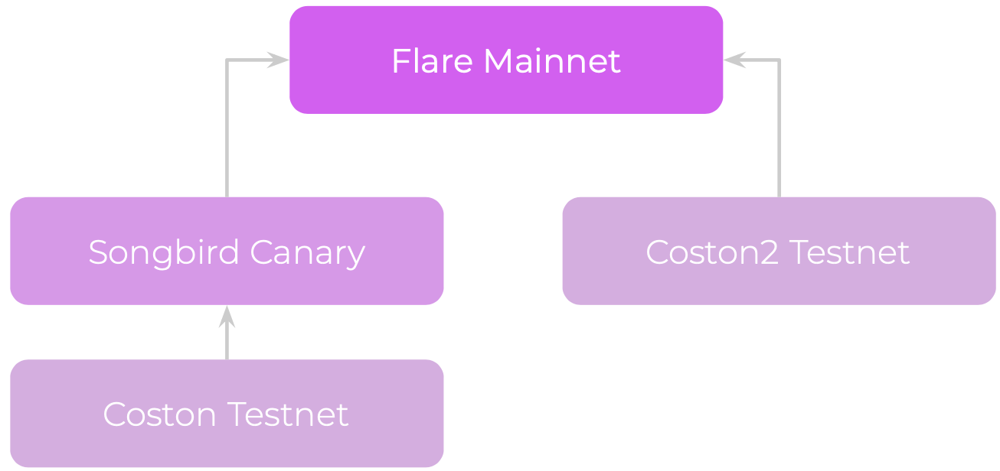

import Tabs from "@theme/Tabs";
import TabItem from "@theme/TabItem";

# Configuration

:::note
Flare supports EVM versions up to London. Learn how to set the EVM version for your compiler in the [Solidity documentation](https://docs.soliditylang.org/en/latest/using-the-compiler.html#setting-the-evm-version-to-target).

```json
// In the standard Solidity JSON interface
{
    "settings": {
        "optimizer": {/* ... */},
        "evmVersion": "london"
    }
}
```
:::

<Tabs>
  <TabItem value="flare" label="Flare" default>
    |               |                                                |
    |---------------|------------------------------------------------|
    | Chain ID      | 14                                             |
    | Currency  | `FLR`                                          |
    | RPCs          | [Chainlist](https://chainlist.org/chain/14)    |
    | Explorers     | [Flarescan](https://flarescan.com), [Flare Explorer](https://flare-explorer.flare.network) |

  </TabItem>
  <TabItem value="coston2" label="Flare Testnet (Coston2)">
    |               |                                                              |
    |---------------|--------------------------------------------------------------|
    | Chain ID      | 114                                                          |
    | Currency  | `C2FLR`                                                       |
    | RPCs          | [Chainlist](https://chainlist.org/chain/114)                 |
    | Explorers     | [Coston2 Explorer](https://coston2-explorer.flare.network) |

  </TabItem>
    <TabItem value="songbird" label="Songbird">
    |               |                                                                 |
    |---------------|--------------------------------------------------------------------------------------------------|
    | Chain ID      | 19                                                 |
    | Currency  | `SGB`                                                                                            |
    | RPCs          | [Chainlist](https://chainlist.org/chain/19)                                                      |
    | Explorers     | [Songbird Flarescan](https://songbird.flarescan.com), [Songbird Explorer](https://songbird-explorer.flare.network)  |

  </TabItem>
  <TabItem value="coston" label="Songbird Testnet (Coston)">
    |               |                                                            |
    |---------------|------------------------------------------------------------|
    | Chain ID      | 16                                                         |
    | Currency  | `CFLR`                                                     |
    | RPCs          | [Chainlist](https://chainlist.org/chain/16)                |
    | Explorers     | [Coston Explorer](https://coston-explorer.flare.network) |

  </TabItem>

</Tabs>

## What are the different networks?

- **Flare** is the main network
- **Coston2** is the test network for Flare
- **Songbird** is the canary network for testing before deploying to Flare
- **Coston** is the test network for Songbird

There are two possible development tracks for any feature, shown in the diagram below:


