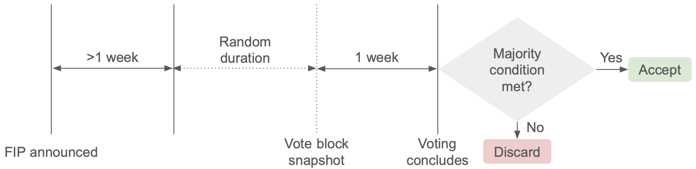

# On-Chain Governance

## Introduction

Flare governance gives everyone in the ecosystem the opportunity to collaborate on decision-making on Flare, making governance an important element of decentralization.

This process enables the Flare Foundation and Flare community members to:

- Propose policy changes
- Vote on them
- Execute them if accepted

If you are already familiar with Flare's governance and just need to know how to cast your vote through the Flare Portal, see the guide on how to [Participate in Flare governance](../../blog/participate-in-flare-governance).

## Flare Improvement Proposals (FIPs)

Flare Improvement Proposals (FIPs) are initiated by the Flare Foundation and are aimed at improving the Flare and Songbird networks. Community-initiated proposals will be supported later. To improve stability, FIPs are rejected by default, i.e. they are accepted only if sufficient votes are cast in their favor.

:::info
All FIPs are published on the [Flare Governance Proposal Site](https://proposals.flare.network) and can be voted on using the [Flare Portal](https://portal.flare.network/voting), or manually by directly interacting with the smart contracts.
:::

### Vote power

To vote on a proposal, an account needs to have wrapped tokens (`WFLR` on Flare). The number of votes an account can cast constitutes their **vote power**, which is equal to the number of wrapped tokens they hold. Proposals are usually annouced at least a week before the voting period starts, so users have time to wrap their tokens if they need to.

:::warning
Native token holdings i.e. `FLR` do not contribute to vote power, only `WFLR` does.
:::

### Vote count block

Since the amount of wrapped tokens an account holds varies over time, a snapshot of all accounts is taken before each voting period starts. The block at which the snapshot is taken is called the **vote count block**. To discourage accounts from acquiring tokens just for voting and then disposing of them, the vote count block is randomly selected.

### Voting process

For an FIP to be accepted, a simple majority (>50%) of the votes cast must be in favor of it. The image below shows a timeline of a typical governance process on Flare.

- **FIP Announced**: The Flare Foundation publishes the proposal online and announces it through social media channels (linked on the footer of this page) and [the Flare website](https://flare.network).
- **Notice period**: Once the proposal is published, the Flare Foundation allows a notice period before voting can start, typically lasting one week. During this time the proposal can be discussed, clarified, commented on, and even cancelled if serious issues are found with it. For security reasons only, the Foundation may reduce the timeframe of this period.
- **Vote block selection period**: The [vote count block](#the-vote-count-block) is selected at a random time during this period. The duration of this period is also random.
- **Voting period**: The proposal is submitted to the [Flare Portal](https://portal.flare.network), and it is immediately available for voting. Voting concludes after a week, and final results are presented on the portal.

## Execution

Once a proposal is accepted, Flare's governance contracts allow for its automatic execution via a contract call.

However, some proposals might require changes that are not implementable through a smart contract and therefore automatic execution is disabled for them. Both FIPs and STPs are manually executed by the Flare Foundation.

## Related guides

- [Participate in Flare governance](../../blog/participate-in-flare-governance)
