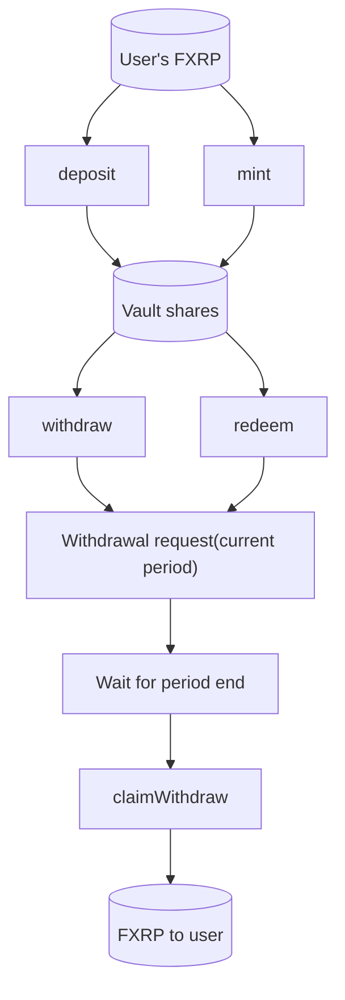

import DocCardList from "@theme/DocCardList";

[Firelight](https://firelight.finance) is a yield-generating protocol built on top of FXRP.
It provides [ERC-4626](https://eips.ethereum.org/EIPS/eip-4626) compliant vault that allows users to deposit FXRP and earn yield through the [FAssets](/fassets/overview) system.

Firelight vaults operate on a [period-based logic](https://docs.firelight.finance/technical-documents#period-based-logic), where deposits and withdrawals are processed at specific intervals.
Users receive vault shares representing their proportional ownership of the vault's assets.

## How Firelight Vaults Work

This diagram shows the flow of operations for a user interacting with a Firelight vault.

The flow of operations for a user interacting with a Firelight vault is as follows:

- **Deposit / Mint:** Two ways to get vault shares.
  Call `deposit(assets)` to deposit FXRP and receive the corresponding shares, or `mint(shares)` to specify the shares you want and pay the required FXRP.

- **Withdraw / Redeem:** Both create a withdrawal request for the current period.
  Call `withdraw(assets)` to request a given amount of assets, or `redeem(shares)` to burn shares and request the equivalent assets.
  Shares are burned when you redeem.

- **Claim:** After the period ends, call `claimWithdraw()` to receive your FXRP.
  Use the [Get Vault Status](/fxrp/firelight/status) and [Claim Withdrawals](/fxrp/firelight/claim) guides to find and claim completed periods.

<DocCardList
  items={[
    {
      type: "link",
      label: "Get Vault Status",
      href: "/fxrp/firelight/status",
      docId: "fxrp/firelight/status",
    },
    {
      type: "link",
      label: "Deposit Assets",
      href: "/fxrp/firelight/deposit",
      docId: "fxrp/firelight/deposit",
    },
    {
      type: "link",
      label: "Mint Shares",
      href: "/fxrp/firelight/mint",
      docId: "fxrp/firelight/mint",
    },
    {
      type: "link",
      label: "Withdraw Assets",
      href: "/fxrp/firelight/withdraw",
      docId: "fxrp/firelight/withdraw",
    },
    {
      type: "link",
      label: "Redeem Shares",
      href: "/fxrp/firelight/redeem",
      docId: "fxrp/firelight/redeem",
    },
    {
      type: "link",
      label: "Claim Withdrawals",
      href: "/fxrp/firelight/claim",
      docId: "fxrp/firelight/claim",
    },
  ]}
/>

:::tip[What's next]

- Learn more about [FAssets](/fassets/overview) and how the system works.
- Explore how to [mint FXRP](/fassets/developer-guides/fassets-mint) from XRP.
- Discover how to [redeem FXRP](/fassets/developer-guides/fassets-redeem) back to XRP.

:::
