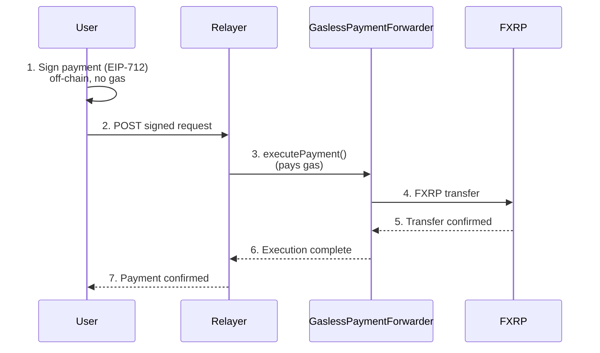

import CodeBlock from "@theme/CodeBlock";
import GaslessPaymentForwarder from "!!raw-loader!/examples/developer-hub-solidity/GaslessPaymentForwarder.sol";
import PaymentUtils from "!!raw-loader!/examples/developer-hub-javascript/fxrp-gasless/payment.ts";
import Relayer from "!!raw-loader!/examples/developer-hub-javascript/fxrp-gasless/relayer.ts";
import DeployScript from "!!raw-loader!/examples/developer-hub-javascript/fxrp-gasless/deploy.ts";
import ExampleUsage from "!!raw-loader!/examples/developer-hub-javascript/fxrp-gasless/example-usage.ts";

This guide explains how to set up gasless FXRP (FAsset) transfers on Flare.
Users sign payment requests off-chain with [EIP-712](https://eips.ethereum.org/EIPS/eip-712) typed data, and a relayer submits them on-chain and pays gas on their behalf.

### Standards explained

[EIP-3009](https://eips.ethereum.org/EIPS/eip-3009) (Transfer with Authorization) extends [ERC-20](https://eips.ethereum.org/EIPS/eip-20) with meta-transactions.
The token holder signs an authorization off-chain, and a relayer executes the transfer on-chain and pays gas.

This guide uses a custom [EIP-712](https://eips.ethereum.org/EIPS/eip-712) payment message and a forwarder contract instead of EIP-3009 on the token itself.
The forwarder pulls FXRP from the user (after a one-time approval) and sends it to the provided recipient.
The relayer pays gas on behalf of the user.

## Architecture

The architecture of the gasless FXRP payments system is as follows:



## Project setup

To follow this guide, create a new [Hardhat](https://hardhat.org/) project or use the [Flare Hardhat Starter](/network/guides/hardhat-foundry-starter-kit) kit.

You will need to install the following dependencies:

```bash
npm install ethers viem express cors dotenv
npm install @openzeppelin/contracts @flarenetwork/flare-periphery-contracts
```

Add the following files to your project:

### Gasless Payment Forwarder Contract

Save as `contracts/GaslessPaymentForwarder.sol` to create the forwarder smart contract that will be used to execute gasless payments.

<details>
<summary>View `contracts/GaslessPaymentForwarder.sol`</summary>

<CodeBlock language="solidity" title="contracts/GaslessPaymentForwarder.sol">
  {GaslessPaymentForwarder}
</CodeBlock>

**How the contract works**

1. Define libraries and state (nonces, authorizedRelayers).
2. Define events (PaymentExecuted, RelayerAuthorized).
3. Define errors.
4. Implement a constructor that sets the EIP-712 domain and owner.
5. Implement `fxrp` to return the FXRP token from the Flare Contract Registry.
6. Define `executePayment(from, to, amount, deadline, signature)`.
7. Hash the request (type hash + from, to, amount, nonce, deadline) and get the [EIP-712](https://eips.ethereum.org/EIPS/eip-712) digest.
8. Recover the signer from the signature.
9. Require signer to be the from address; increment nonce.
10. Require sufficient allowance; transfer amount from sender to recipient.
11. Define view functions: getNonce, getDomainSeparator, getPaymentRequestHash.
12. Define setRelayerAuthorization for the relayer allowlist.

</details>

Run the following command to compile the contract and generate the typechain-types:

```bash
npx hardhat compile
```

It will generate the `typechain-types` directory with the contract interfaces and factories.

### Utilities

Save as `utils/payment.ts` to create the utility functions that will be used to create and sign payment requests off-chain.

:::info

This utility uses the `typechain-types` generated by the previous command.

:::

<details>
<summary>View `utils/payment.ts`</summary>

<CodeBlock language="typescript" title="utils/payment.ts">
  {PaymentUtils}
</CodeBlock>

**Code Breakdown**

1. Import the necessary libraries.
2. Define constants and EIP-712 types (PaymentRequest: from, to, amount, nonce, deadline).
3. Define types for sign params, payment request, approval result, and user status.
4. Parse human-readable amount to raw bigint with decimals.
5. Format the raw amount to a readable string with decimals.
6. Get FXRP decimals from the forwarder and token contract.
7. Get the current nonce for a user from the forwarder.
8. Sign the payment message with EIP-712 and return the signature.
9. Create a full payment request: fetch nonce, set deadline, sign, return payload for the relayer.
10. Approve the forwarder to spend FXRP (one-time).
11. Check user balance, allowance, nonce, and whether approval is needed.

</details>

### Relayer Service

This is a relayer service that submits payment requests to the Flare blockchain and pays gas on behalf of the user.

Save as `relayer/index.ts` to start the relayer service.

<details>
<summary>View `relayer/index.ts`</summary>

<CodeBlock language="typescript" title="relayer/index.ts">
  {Relayer}
</CodeBlock>

**Code Breakdown**

1. Import necessary libraries.
2. Define EIP-712 domain and payment request types (from, to, amount, nonce, deadline); define NETWORKS (flare, coston2, songbird).
3. Define RelayerConfig, PaymentRequest, and ExecuteResult types.
4. Implement GaslessRelayer class: constructor sets provider, wallet, and forwarder.
5. Execute payment: normalize and validate request, recover signer with EIP-712, validate request (balance, allowance, deadline), staticCall, recheck nonce, estimate gas, call executePayment, wait for receipt, return result.
6. Validate request: check deadline against chain time, check sender balance and allowance.
7. Get nonce for an address from the forwarder.
8. Get FXRP token decimals from the forwarder and token contract.
9. Get the relayer FLR balance for gas.
10. Start Express server: GET /nonce/:addr, POST /execute.
11. Main: read env (RELAYER_PRIVATE_KEY, FORWARDER_ADDRESS, RPC_URL, PORT), create relayer, log FLR balance, start server.
12. Run main to start the relayer service.

</details>

### Deploy Script

Save as `scripts/deploy.ts` to deploy the [`GaslessPaymentForwarder`](/fxrp/token-interactions/gasless-fxrp-payments#gasless-payment-forwarder-contract) contract.

<details>
<summary>View scripts/deploy.ts</summary>

<CodeBlock language="typescript" title="scripts/deploy.ts">
  {DeployScript}
</CodeBlock>

**Code Breakdown**

1. Import Hardhat and TypeChain types.
2. Get deployer signer and balance; log address and FLR balance.
3. Deploy GaslessPaymentForwarder (no constructor args; FXRP from Flare Contract Registry); wait for deployment and get address.
4. Get FXRP token address from the forwarder; log deployment summary (network, contract, FXRP, owner).
5. Verify contract on block explorer (constructor arguments empty).
6. Run main: exit 0 on success, exit 1 on error.

</details>

### Example Flow

Use `scripts/example-usage.ts` to run the example flow.

<details>
<summary>View scripts/example-usage.ts</summary>

<CodeBlock language="typescript" title="scripts/example-usage.ts">
  {ExampleUsage}
</CodeBlock>

**Code Breakdown**

1. Import the necessary libraries.
2. Read configuration from the environment like the RPC URL, relayer URL, forwarder address, and user private key.
3. Validate the configuration to ensure that the forwarder address and user private key are set.
4. Create a provider and a wallet.
5. Check user FXRP balance and allowance.
6. Approve the forwarder to spend FXRP.
7. Create a payment request and sign it.
8. Submit the payment request to the relayer.
9. Call the main function to run the example flow.

</details>

## Configuration

Create a `.env` file in your project root with the following variables:

| Variable              | Description                                     |
| --------------------- | ----------------------------------------------- |
| `PRIVATE_KEY`         | Deployer private key (for deployment)           |
| `RELAYER_PRIVATE_KEY` | Relayer wallet (pays gas)                       |
| `USER_PRIVATE_KEY`    | User wallet for testing                         |
| `FORWARDER_ADDRESS`   | Deployed contract address (set after deploy)    |
| `RPC_URL`             | Flare network RPC (e.g. Coston2 testnet)        |
| `RELAYER_URL`         | Relayer HTTP URL (e.g. `http://localhost:3000`) |

## Deploy and run

### Compile Contracts

Run the following command to compile the contracts:

```bash
npx hardhat compile
```

### Deploy the Forwarder

Deploy the [`GaslessPaymentForwarder`](/fxrp/token-interactions/gasless-fxrp-payments#gasless-payment-forwarder-contract) contract to Coston2 (testnet):

```bash
npx hardhat run scripts/deploy.ts --network coston2
```

Set `FORWARDER_ADDRESS` in `.env` to the deployed contract address.

### Start the Relayer

Run the following command to start the relayer service.

The relayer is an Express server that submits payment requests on the Flare blockchain and pays gas on behalf of the user.

```bash
npx ts-node relayer/index.ts
```

**Main relayer backend endpoints:**

| Method | Path              | Description            |
| ------ | ----------------- | ---------------------- |
| POST   | `/execute`        | Execute single payment |
| GET    | `/nonce/:address` | Get nonce for address  |

### Run the example Flow

Run the following command to run the example:

```bash
npx ts-node scripts/example-usage.ts
```

This script will execute the following steps:

1. Checks the user's balance and allowance.
2. Approves the forwarder to spend FXRP if needed.
3. Creates a payment request.
4. Submits the payment request to the relayer.
5. Checks the payment status.

You should see the following output:

<details>
<summary>View example output</summary>

```console
=== FXRP Gasless Payment Example ===

User address: 0x0d09ff7630588E05E2449aBD3dDD1D8d146bc5c2
Forwarder: 0xffc5F792e1Ca050B598577fFaFa30634A66174A5
Relayer: http://localhost:3000

Step 1: Checking FXRP balance and allowance...
 FXRP Token: 0x0b6A3645c240605887a5532109323A3E12273dc7
 Balance: 11773.287907 FXRP
 Allowance: 0.0 FXRP
 Nonce: 0

Step 2: Approving FXRP for gasless payments...
 Approved! TX: 0x4aa5304c4e3e261d9d88ac1fe24a9d96faaa5786065a9253de463a5c33d0c368

Step 3: Creating payment request...
 To: 0x5EEeaD99dFfeB32Fe96baad6554f6E009c8B348a
 Amount: 0.1 FXRP

 Signed request created:
 From: 0x0d09ff7630588E05E2449aBD3dDD1D8d146bc5c2
 To: 0x5EEeaD99dFfeB32Fe96baad6554f6E009c8B348a
 Amount: 0.1 FXRP
 Deadline: 2026-02-13T14:14:20.000Z
 Signature: 0x0cc5532b3c67eb0ef4...

Step 4: Submitting to relayer...
 Payment executed successfully!
 Transaction: 0xd18b532b294656fbeadd4884b6baf5e45efabb3809787c1625f675cccff2b648
 Block: 27196879
 Gas used: 229589
```

</details>

:::tip[Next steps]

- [Get FXRP token address](/fxrp/token-interactions/fxrp-address) for use in your app.
- [Swap USDT0 to FXRP](/fxrp/token-interactions/usdt0-fxrp-swap) to acquire FXRP.
- Review [FXRP operational parameters](/fxrp/parameters).
- [Gasless USD₮0 Transfers](/network/guides/gasless-usdt0-transfers) — Similar pattern for USDT0 on Flare.
  :::
