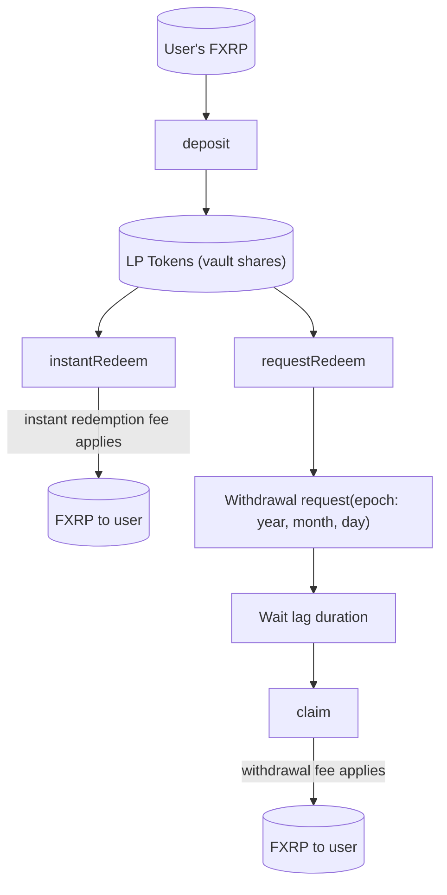

import DocCardList from "@theme/DocCardList";

[Upshift](https://upshift.finance) is a yield-generating protocol that supports FXRP through strategy-driven vaults on Flare.
It provides [ERC-4626](https://eips.ethereum.org/EIPS/eip-4626) style vaults that allow users to deposit FXRP and earn yield generated from on-chain DeFi strategies, while abstracting away strategy execution and risk management.

Upshift vaults support both instant and requested redemptions, depending on available liquidity.
Users receive vault shares that represent their proportional ownership of the vault's assets, with yield accruing as share value increases over time.

[Upshift vault](https://app.upshift.finance/pools/14/0x373D7d201C8134D4a2f7b5c63560da217e3dEA28) is part of the XRP finance stack on Flare Network.
It inherits the transparency model of the [FAssets](/fassets/overview) system: minting and redemption are proof-backed, and vault interactions are recorded on-chain.

- **Funds are on-chain:** User deposits, vault balances, withdrawal requests, and claims are executed as smart contract state changes on Flare.
  You can verify all vault holdings on [DeBank](https://debank.com/profile/0xEDb7B1e92B8D3621b46843AD024949F10438374B) portfolio tracker.
- **User ownership is verifiable:** A user's position is represented directly on-chain and can be queried from smart contracts.
- **Instruction flow is auditable:** XRPL-triggered actions are executed on Flare via [Smart Accounts](/smart-accounts/overview) with [Flare Data Connector](/fdc/overview) backed verification and onchain execution.
  You can verify all smart account activity on the [Flare Systems Explorer](https://flare-systems-explorer.flare.network/smart-accounts).

## How Upshift Vaults Work

This diagram shows the flow of operations for a user interacting with an Upshift vault.

The flow of operations for a user interacting with an Upshift vault is as follows:

- **Deposit:** Transfer FXRP to the vault and receive the corresponding LP tokens (shares).
  Yield accrues as share value increases.

- **Instant redeem:** Burn the corresponding LP tokens and receive FXRP immediately via the `instantRedeem()` function.
  In this case you need to pay the instant redemption fee.
  Use this option when you need liquidity right away.

- **Requested redeem:** Lock the LP tokens with `requestRedeem()` and create a withdrawal request for the current epoch.
  After the lag duration, call `claim(year, month, day, receiver)` to receive FXRP.
  Lower fee than instant redeem.
  Use this option when you can wait.

<DocCardList
  items={[
    {
      type: "link",
      label: "Get Vault Status",
      href: "/fxrp/upshift/status",
      docId: "fxrp/upshift/status",
    },
    {
      type: "link",
      label: "Deposit Assets",
      href: "/fxrp/upshift/deposit",
      docId: "fxrp/upshift/deposit",
    },
    {
      type: "link",
      label: "Instant Redeem",
      href: "/fxrp/upshift/instant-redeem",
      docId: "fxrp/upshift/instant-redeem",
    },
    {
      type: "link",
      label: "Request Redeem",
      href: "/fxrp/upshift/request-redeem",
      docId: "fxrp/upshift/request-redeem",
    },
  ]}
/>

:::tip[What's next]

- Learn more about [FAssets](/fassets/overview) and how the system works.
- Explore how to [mint FXRP](/fassets/developer-guides/fassets-mint) from XRP.
- Discover how to [redeem FXRP](/fassets/developer-guides/fassets-redeem) back to XRP.

:::
