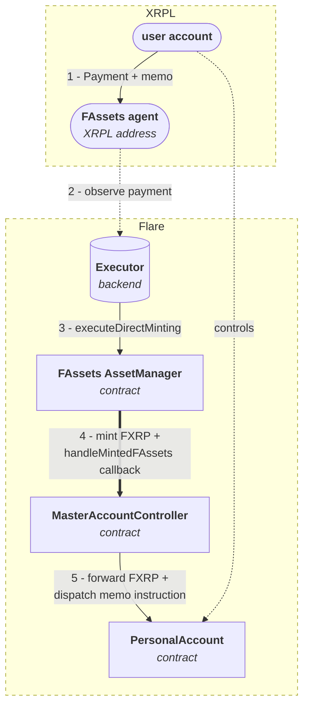

import ThemedImage from "@theme/ThemedImage";
import useBaseUrl from "@docusaurus/useBaseUrl";
import YouTubeEmbed from "@site/src/components/YouTubeEmbed";

The Flare Smart Accounts is an account abstraction that allows XRPL users to perform actions on the Flare chain without owning any FLR token.
Each XRPL address is assigned a unique **smart account** on the Flare chain, which it can control alone.
They do so through `Payment` transactions on the XRPL.
The Flare Smart Accounts are especially useful for interacting with the FAssets workflow.

## Workflow

Flare Smart Accounts support two complementary flows for turning an XRPL `Payment` into actions on Flare.

### Proof-based flow (payment reference)

1. The XRPL user sends a `Payment` transaction to the operator's XRPL address with a 32-byte instruction encoded as the **payment reference**.
2. The operator requests a [`Payment` attestation](/fdc/attestation-types/payment) from the [Flare Data Connector (FDC)](/fdc/overview) and submits it to the `MasterAccountController`.
3. The XRPL user's `PersonalAccount` performs the action encoded in the reference.

<ThemedImage
  alt="Flare Smart Accounts proof-based flow"
  sources={{
    light: useBaseUrl("img/docs/smart-accounts/fsa-workflow-light.png"),
    dark: useBaseUrl("img/docs/smart-accounts/fsa-workflow-dark.png"),
  }}
/>

  Proof-based flow: XRPL `Payment` (1) → operator backend (2) → FDC attestation
  (3, 4) → `MasterAccountController` (5) → `PersonalAccount` (6).

### Direct-minting (memo) flow

1. The XRPL user sends a `Payment` to an FAssets agent's XRPL address that mints FXRP directly to the smart account, with the [memo field](/smart-accounts/custom-instruction-comparison) carrying the instruction.
2. The FAssets `AssetManager` mints FXRP to the `MasterAccountController` and calls back into [`handleMintedFAssets`](/smart-accounts/reference/IMasterAccountController#handlemintedfassets).
3. The `MasterAccountController` routes the FAssets to the user's `PersonalAccount`, optionally pays an executor fee, and dispatches any [memo instruction](#memo-opcodes-direct-minting-flow).

  Direct-minting flow: XRPL `Payment` carrying a memo (1) → FAssets agent (2) →
  executor calls `AssetManager.executeDirectMinting` (3) → `AssetManager` mints
  FXRP and calls back into `handleMintedFAssets` (4) → `MasterAccountController`
  forwards FXRP and dispatches the memo to the user's `PersonalAccount` (5).

## Instructions on XRPL

The Flare Smart Accounts allow XRPL users to perform actions on the Flare chain through instructions on the XRPL.
This is done through a `Payment` to an XRPL address, designated by the operator, a backend monitoring incoming transactions and interacting with the Flare chain.
The payment must transfer sufficient funds, as specified by the operator, and must include the proper payment reference (proof-based flow) or memo (direct-minting flow).

The payment reference is a `bytes32` value.
The first byte is reserved for the instruction code.
The second byte is a wallet identifier.
This is a number assigned to wallet providers by the Flare Foundation, and should otherwise be `0`.
The remaining 30 bytes are the parameters for the chosen instruction.

In practice, the payment reference should be prepared by a backend, through a web form.

The first, instruction code, byte is further subdivided into two half-bytes.
The first nibble is the instruction type.
This is either `FXRP`, `Firelight`, or `Upshift` (with corresponding type IDS `0`, `1`, and `2`).
The second nibble is the instruction command; the available commands are different for each instruction type.

For the direct-minting flow, the memo carries a different layout; the first byte selects one of the [memo opcodes](#memo-opcodes-direct-minting-flow) listed below.

  
Table of instruction IDs and corresponding actions.

### FXRP

Instructions for interacting with the `FXRP` token.

**Type ID:** `00`.

| Command ID | Action                  | Description                                                                                                                                 |
| ---------- | ----------------------- | ------------------------------------------------------------------------------------------------------------------------------------------- |
| `00`       | `collateralReservation` | Reserve a `value` of lots of collateral in the agent vault, registered with the `agentVaultId` with the `MasterAccountController` contract. |
| `01`       | `transfer`              | Transfer a `value` (in drops) of FXRP to the `recipientAddress`.                                                                            |
| `02`       | `redeem`                | Redeem a `value` of lots of FXRP.                                                                                                           |

### Firelight

Instructions for interacting with a Firelight-type vault.

**Type ID:** `01`.

| Command ID | Action                            | Description                                                                                                                                                                                                                                                                                                                                                                                         |
| ---------- | --------------------------------- | --------------------------------------------------------------------------------------------------------------------------------------------------------------------------------------------------------------------------------------------------------------------------------------------------------------------------------------------------------------------------------------------------- |
| `00`       | `collateralReservationAndDeposit` | Reserve a `value` of lots of collateral in the agent vault, registered with the `agentVaultId` with the `MasterAccountController` contract. After successful minting, deposit the FXRP into the Firelight type vault, registered with the `vaultId` with the `MasterAccountController` contract. Equivalent to sending a `collateralReservation` instruction and a Firelight `deposit` instruction. |
| `01`       | `deposit`                         | Deposit a `value` of FXRP into the Firelight type vault, registered with the `vaultId` with the `MasterAccountController` contract.                                                                                                                                                                                                                                                                 |
| `02`       | `redeem`                          | Start the withdrawal process for a `value` of vault shares (in drops) from the Firelight type vault, registered with the `vaultId`, with the `MasterAccountController` contract.                                                                                                                                                                                                                    |
| `03`       | `claimWithdraw`                   | Withdraw the `FXRP`, requested in the `value` period, from the Firelight type vault, registered with the `vaultId`, with the `MasterAccountController` contract.                                                                                                                                                                                                                                    |

### Upshift

Instructions for interacting with an Upshift-type vault.

**Type ID:** `02`.

| Command ID | Action                            | Description                                                                                                                                                                                                                                                                                                                                                                                      |
| ---------- | --------------------------------- | ------------------------------------------------------------------------------------------------------------------------------------------------------------------------------------------------------------------------------------------------------------------------------------------------------------------------------------------------------------------------------------------------ |
| `00`       | `collateralReservationAndDeposit` | Reserve a `value` of lots of collateral in the agent vault, registered with the `agentVaultId` with the `MasterAccountController` contract. After successful minting, deposit the FXRP into the Upshift type vault, registered with the `vaultId`, with the `MasterAccountController` contract. Equivalent to sending a `collateralReservation` instruction and a Upshift `deposit` instruction. |
| `01`       | `deposit`                         | Deposit a `value` of FXRP into the Upshift type vault, registered with the `vaultId` with the `MasterAccountController` contract.                                                                                                                                                                                                                                                                |
| `02`       | `requestRedeem`                   | Start the withdrawal process for a `value` of vault shares (in drops) from the Upshift type vault, registered with the `vaultId` with the `MasterAccountController` contract.                                                                                                                                                                                                                    |
| `03`       | `claim`                           | Withdraw the `FXRP` requested for the `value` date (encoded as `yyyymmdd`) from the Upshift type vault, registered with the `vaultId` with the `MasterAccountController` contract.                                                                                                                                                                                                               |

### Memo opcodes (direct-minting flow)

The XRPL memo for the direct-minting flow selects one of the following opcodes in its first byte:

| Memo opcode | Action                        | Description                                                                                                                                                                                                                                                                                                           |
| ----------- | ----------------------------- | --------------------------------------------------------------------------------------------------------------------------------------------------------------------------------------------------------------------------------------------------------------------------------------------------------------------- |
| `0xFE`      | Custom Instruction            | Carry `keccak256(PackedUserOperation)` in the memo; the bytes are delivered off-chain by an executor. See [Custom Instruction](/smart-accounts/custom-instruction).                                                                                                                                                   |
| `0xFF`      | Memo Field Custom Instruction | Carry the full ABI-encoded `PackedUserOperation` inline in the memo. See [Memo Field Custom Instruction](/smart-accounts/memo-field-custom-instruction).                                                                                                                                                              |
| `0xE0`      | Skip memo                     | Mark a target XRPL transaction's memo to be skipped on its next direct mint. Used to recover FXRP when [`executeDirectMintingWithData`](/fassets/reference/IAssetManager#executedirectmintingwithdata) reverts — see [Recovery after a failed mint](/smart-accounts/custom-instruction#recovery-after-a-failed-mint). |
| `0xE1`      | Fast-forward nonce            | Advance the personal account's memo-instruction nonce when it is stuck after a partial or abandoned flow.                                                                                                                                                                                                             |
| `0xE2`      | Replace executor fee          | Set a replacement executor fee for a stuck XRPL transaction.                                                                                                                                                                                                                                                          |
| `0xD0`      | Pin executor                  | Pin a specific executor address to the personal account.                                                                                                                                                                                                                                                              |
| `0xD1`      | Unpin executor                | Unpin the executor from the personal account.                                                                                                                                                                                                                                                                         |

The [Custom Instruction Comparison](/smart-accounts/custom-instruction-comparison) covers when to choose `0xFE` over `0xFF`.

## Dispatch on Flare

### Proof-based flow

The operator monitors incoming transactions to the specified XRPL address.
Upon receiving a payment, it requests a [`Payment` attestation](/fdc/attestation-types/payment) from the FDC and submits the proof together with the user's XRPL address to the appropriate function on the `MasterAccountController`:

- [`reserveCollateral`](/smart-accounts/reference/IMasterAccountController#reservecollateral) — for command `00` of any instruction type.
  Takes the payment reference and XRPL transaction ID (no FDC proof needed at this stage, the user has only committed to mint).
- [`executeDepositAfterMinting`](/smart-accounts/reference/IMasterAccountController#executedepositafterminting) — second leg of the Firelight/Upshift collateral-reservation-and-deposit instructions, after FAssets minting completes.
- [`executeInstruction`](/smart-accounts/reference/IMasterAccountController#executeinstruction) — for all other reference-encoded instructions.

For the proof-bearing functions, the contract verifies the FDC proof and checks that:

- the receiving address matches one of the registered operator XRPL addresses,
- the source address matches the XRPL address passed to the function,
- the XRPL transaction ID has not already been used (replay protection via `usedTransactionIds`).

The contract then resolves the XRPL user's `PersonalAccount` from the address mapping, deploying it via `CREATE2` if it does not yet exist, and dispatches the instruction encoded in the payment reference.

### Direct-minting flow

When the user mints FXRP directly to their smart account via [FAssets direct minting](/fassets/direct-minting), the FAssets `AssetManager` calls back into [`handleMintedFAssets`](/smart-accounts/reference/IMasterAccountController#handlemintedfassets) on the `MasterAccountController`.
It enforces that the caller is the `AssetManager`, resolves (or deploys) the user's `PersonalAccount`, pays an executor fee out of the minted FAssets, forwards the remainder to the personal account, and dispatches any [memo instruction](#memo-opcodes-direct-minting-flow).

## Actions on Flare

The XRPL user's smart account performs the actions in the instructions.
This can be any of the instructions listed above, reserving collateral for minting FXRP, transferring FXRP to another address, redeeming FXRP, depositing it into a vault ...
Furthermore, custom instructions can be executed - arbitrary function calls on Flare, encoded as an [EIP-4337](https://eips.ethereum.org/EIPS/eip-4337) `PackedUserOperation` and replayed on-chain by the personal account.
The user operation can be committed to as a 32-byte hash with the bytes delivered to Flare by an off-chain executor (opcode `0xFE`, see the [Custom Instruction guide](/smart-accounts/custom-instruction)), or carried in the XRPL memo in full (opcode `0xFF`, see the [Memo Field Custom Instruction guide](/smart-accounts/memo-field-custom-instruction)).
Authorization comes from the XRPL `Payment` signature itself; the on-chain check only validates the `sender` and `nonce` fields of the `PackedUserOperation`.
The [Custom Instruction Comparison](/smart-accounts/custom-instruction-comparison) covers when to pick each.

## Video Tutorials

<YouTubeEmbed videoId="LZ6WI9Zvrn4"></YouTubeEmbed>

<YouTubeEmbed videoId="txYLJV9cHzg"></YouTubeEmbed>
