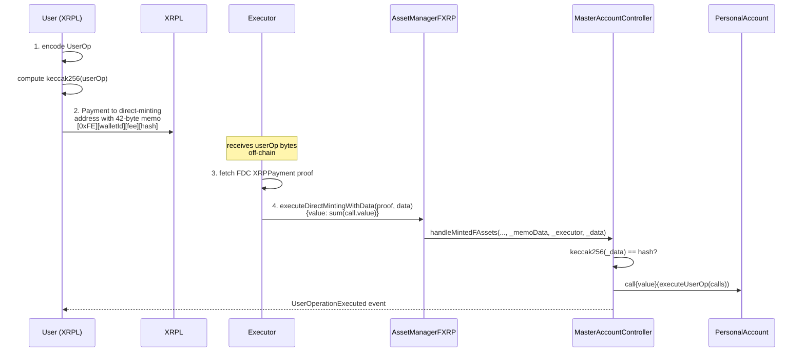

import ThemedImage from "@theme/ThemedImage";
import useBaseUrl from "@docusaurus/useBaseUrl";

Flare Smart Accounts let an XRPL user execute arbitrary contract calls on Flare through an XRPL [`Payment`](https://xrpl.org/docs/references/protocol/transactions/types/payment) transaction.
Each personal account exposes an [EIP-4337](https://eips.ethereum.org/EIPS/eip-4337) style `executeUserOp` entry point that the [`MasterAccountController`](/smart-accounts/reference/IMasterAccountController) invokes when it processes a custom instruction memo.

The **custom instruction** (memo opcode `0xFE`) is the recommended way to drive those calls.
The XRPL memo is a fixed 42 bytes that commits to a `PackedUserOperation` by carrying only its `keccak256` hash, and an off-chain executor delivers the actual user operation bytes to the FAssets `AssetManager` on Flare.
This keeps the XRPL footprint constant regardless of how complex the call batch is.

For the simpler single-actor variant that ships the entire `PackedUserOperation` inline in the XRPL memo, see the [Memo Field Custom Instruction](/smart-accounts/memo-field-custom-instruction); the [comparison guide](/smart-accounts/custom-instruction-comparison) covers when to pick which.

:::warning No destination tags
XRPL transactions targeting smart accounts must not use a destination tag.
A destination tag forces [FAssets direct minting](/fassets/direct-minting) to credit the tag-holder, which would let an unrelated party front-run the user operation.
:::

## User Operation Payload

A custom instruction has two layers: the outer [EIP-4337](https://eips.ethereum.org/EIPS/eip-4337) [`PackedUserOperation`](https://eips.ethereum.org/EIPS/eip-4337#useroperation) that the XRPL memo commits to, and the inner [`executeUserOp(Call[])`](/smart-accounts/reference/IPersonalAccount#executeuserop) that the personal account runs once the controller dispatches it.

Only three fields from the [`PackedUserOperation`](https://eips.ethereum.org/EIPS/eip-4337#useroperation) struct are required for Flare Smart Accounts:

- `sender` **must** equal the address of the personal account derived from the XRPL sender.
  Use [`getPersonalAccount`](/smart-accounts/reference/IMasterAccountController#getpersonalaccount) to look it up - the address is deterministic, so you can fetch it before the account is even deployed.
- `nonce` **must** equal the personal account's current nonce returned by [`getNonce`](/smart-accounts/reference/IMasterAccountController#getnonce).
  The nonce auto-increments on every successful execution to prevent replay.
- `callData` is the data that the controller invokes on the personal account.
  In practice, this is `abi.encodeCall(IPersonalAccount.executeUserOp, (calls))` - anything else either reverts or is rejected by the personal account's `onlyController` modifier.

The remaining fields are not validated on-chain and can be left empty.
Authorization comes from the XRPL signature on the `Payment` XRPL payment transaction itself: only the XRPL key for `sender`'s `xrplOwner` can deliver the memo.
If the personal account has pinned an executor via [`getExecutor`](/smart-accounts/reference/IMasterAccountController#getexecutor), only that executor is permitted to relay the mint.

### `executeUserOp` and the `Call` struct

The personal account's [`executeUserOp(Call[])`](/smart-accounts/reference/IPersonalAccount#executeuserop) runs each entry in the `Call[]` in order, forwarding it with its supplied `value` and `data`:

```solidity
struct Call {
  address target;
  uint256 value;
  bytes data;
}

function executeUserOp(Call[] calldata _calls) external payable;
```

Each call is dispatched with the personal account as `msg.sender`.
If any call reverts, the whole user operation reverts with [`CallFailed`](/smart-accounts/reference/IPersonalAccount#callfailed) - partial execution is not possible.

The `executeUserOp` function is `payable`, so the user operation can forward native tokens (e.g. FLR) alongside the calls.
To fund the personal account, send FLR to the address using the [Flare faucet](https://faucet.flare.network/).

### Building `callData` in TypeScript

You can build the `callData` in TypeScript using the [`encodeFunctionData`](https://viem.sh/docs/contract/encodeFunctionData#encodefunctiondata) function from the `viem` library:

```typescript
import { encodeFunctionData } from "viem";

const calls = [
  {
    target: counterAddress,
    value: 0n,
    data: encodeFunctionData({
      abi: counterAbi,
      functionName: "increment",
      args: [],
    }),
  },
];

const callData = encodeFunctionData({
  abi: personalAccountAbi,
  functionName: "executeUserOp",
  args: [calls],
});
```

The encoded `callData` becomes the `callData` field of the `PackedUserOperation` that the XRPL memo commits to.

## Memo Layout

The custom instruction memo is a constant 42 bytes:

| Bytes   | Field            | Meaning                                                             |
| ------- | ---------------- | ------------------------------------------------------------------- |
| `0`     | `instructionId`  | `0xFE` - custom instruction                                         |
| `1`     | `walletId`       | One-byte wallet identifier assigned by Flare; `0` if not registered |
| `2-9`   | `executorFeeUBA` | Executor fee in the FAsset's smallest unit, big-endian `uint64`     |
| `10-41` | `userOpHash`     | `keccak256(abi.encode(userOp))` - the 32-byte commitment            |

The memo length is independent of the call batch: a single small call and a 50-call batch both fit in the same 42 bytes, because the user-operation bytes the executor delivers off-chain never touch the XRPL ledger.
This is the main practical advantage over the [Memo Field Custom Instruction](/smart-accounts/memo-field-custom-instruction), whose memo carries the entire ABI-encoded `PackedUserOperation` and is therefore subject to the XRPL's 1024-byte memo cap.

The off-chain delivery also makes the call payload **private on XRPL**.
Only the 32-byte commitment is published; the inner `target`, `value`, and `data` of each call only become visible when the executor submits the user operation to Flare.

## Three-step Protocol

The `0xFE` flow runs three steps that map onto two independent actors.
A demo script can run all three from the same process, but the on-chain checks are designed around the two-actor split.
The executor bridges the XRPL payment to Flare with a proof from the [Flare Data Connector (FDC)](/fdc/overview), the same attestation system used by the proof-based flow:



### Step 1: User Side

The user constructs the `PackedUserOperation` as described in [User operation payload](#user-operation-payload), computes `keccak256` over the ABI encoding, and packs the 42-byte memo from [Memo layout](#memo-layout).

The user sends an XRPL `Payment` to the FAssets [direct minting address](/fassets/reference/IAssetManager#directmintingpaymentaddress) with this memo, and delivers the full `PackedUserOperation` bytes to the executor **off-chain** (e.g. over an authenticated HTTP API).

### Step 2: Executor Side

The executor takes the XRPL transaction hash, requests an [`XRPPayment` attestation](/fdc/attestation-types/xrp-payment) from the [Flare Data Connector](/fdc/overview), and calls `executeDirectMintingWithData` on `AssetManagerFXRP` (see the [FAssets direct minting page](/fassets/direct-minting)):

```solidity
function executeDirectMintingWithData(
    IXRPPayment.Proof calldata _payment,
    bytes calldata _data
) external payable;
```

- `_payment` is the FDC proof of the XRPL `Payment`.
- `_data` is the ABI-encoded `PackedUserOperation` that was delivered off-chain.
- `msg.value` **must equal the sum of `call.value` across the user operation**.
  The `AssetManagerFXRP` forwards this value to the `MasterAccountController` function `handleMintedFAssets`, which forwards it to the personal account's `executeUserOp` function so that the inner calls can attach the native value.

The `executeDirectMintingWithData` function is **only valid for smart-account targets** - calling it for a non-smart-account direct mint reverts.

### Step 3: Confirmation

The `MasterAccountController` verifies on-chain that `keccak256(_data) == userOpHash` from the memo.
If it matches, it decodes `_data` as a `PackedUserOperation`, validates `sender` and `nonce`, executes `executeUserOp` on the personal account, and emits [`UserOperationExecuted`](/smart-accounts/reference/IMasterAccountController#useroperationexecuted) - **all inside the executor's transaction**.
This is the key difference from the proof-based dispatch: there is no separate cross-chain wait, because the executor's call already executed the user operation by the time it returns.

## Hash Mismatch

If the bytes the executor submits do not hash to the commitment in the memo, `handleMintedFAssets` reverts with `CustomInstructionHashMismatch(expected, actual)`.
Because `executeDirectMintingWithData` is fully atomic, the entire Flare transaction reverts — no FXRP is minted.
The underlying XRP remains at the [Core Vault](/fassets/core-vault) until a successful direct mint finalizes it (see [Failure Handling](#failure-handling) and [Recovery after a failed mint](#recovery-after-a-failed-mint)).

## Call Value Accounting

Whatever native value the executor attaches to `executeDirectMintingWithData` is forwarded all the way to `executeUserOp` (`AssetManagerFXRP -> MasterAccountController.handleMintedFAssets -> PersonalAccount.executeUserOp`).
The executor must therefore compute the total native value to attach as the sum of `call.value` across the user operation it received off-chain.
The user-side helper in the [TypeScript guide](/smart-accounts/guides/typescript-viem/custom-instruction-ts) returns this value alongside the XRPL transaction hash, so the executor does not have to recompute it from scratch.

## Replay Protection

Two replay-protection layers gate every custom instruction:

- The user operation's `nonce` must equal the personal account's current memo-instruction nonce; the nonce auto-increments on every successful execution.
- The XRPL transaction ID is recorded in the controller and cannot be reused for a second mint.

The on-chain hash check additionally pins the executor's `_data` to the exact bytes the user signed via XRPL, so the executor cannot substitute a different payload after the fact.

## Failure Handling

When [`executeDirectMintingWithData`](/fassets/reference/IAssetManager#executedirectmintingwithdata) reverts, the entire Flare transaction rolls back atomically:

- **No FXRP is minted** on Flare.
- **No user operation runs** — there is no [`UserOperationExecuted`](/smart-accounts/reference/IMasterAccountController#useroperationexecuted) event.
- The XRPL payment is **not reversed** — the underlying XRP remains at the [Core Vault](/fassets/core-vault) until a successful direct mint finalizes it.
  It is not automatically refunded to the user's XRPL wallet.

This failure path should be rare.
The intended UX is **mint plus user operation in one atomic Flare transaction** — for example, minting FXRP and withdrawing it to an EOA in a single `executeDirectMintingWithData` call.

### Common revert reasons

Any validation or execution failure inside [`handleMintedFAssets`](/smart-accounts/reference/IMasterAccountController#handlemintedfassets) reverts the whole call:

- If `sender` does not match the personal account, the call reverts with [`InvalidSender`](/smart-accounts/reference/IMasterAccountController#invalidsender).
- If `nonce` is not the expected value, it reverts with [`InvalidNonce`](/smart-accounts/reference/IMasterAccountController#invalidnonce).
- If the memo length is not exactly `42` bytes, `handleMintedFAssets` reverts with [`InvalidMemoData`](/smart-accounts/reference/IMasterAccountController#invalidmemodata); an unrecognized instruction byte reverts with [`InvalidInstructionId`](/smart-accounts/reference/IMasterAccountController#invalidinstructionid).
- If `keccak256(_data)` does not match the hash in the memo, the call reverts with `CustomInstructionHashMismatch(expected, actual)`.
- If the executor's `msg.value` is less than the sum of `call.value` across the inner calls, the inner call reverts with [`CallFailed`](/smart-accounts/reference/IPersonalAccount#callfailed) and the whole transaction reverts.
- If the personal account has pinned an executor via [`getExecutor`](/smart-accounts/reference/IMasterAccountController#getexecutor) and the caller of `executeDirectMintingWithData` is not that executor, the call reverts with [`WrongExecutor`](/smart-accounts/reference/IMasterAccountController#wrongexecutor).
- If any inner call reverts, the personal account surfaces it as [`CallFailed`](/smart-accounts/reference/IPersonalAccount#callfailed) and the entire transaction reverts.

### Recovery after a failed mint

If `executeDirectMintingWithData` reverts and the XRPL payment is still unminted, the user can recover FXRP without executing the original custom instruction:

1. Send an XRPL [`Payment`](https://xrpl.org/docs/references/protocol/transactions/types/payment) with memo opcode **`0xE0` (Skip memo)** targeting the stuck payment's transaction ID.
   This emits [`IgnoreMemoSet`](/smart-accounts/reference/IMasterAccountController#ignorememoset) on the personal account.
2. The executor re-submits [`executeDirectMintingWithData`](/fassets/reference/IAssetManager#executedirectmintingwithdata) with the original FDC `XRPPayment` proof.
   The skip flag causes the controller to mint FXRP to the personal account **without** dispatching the original user operation.
3. The user can then move the FXRP through standard [FAssets instructions](/smart-accounts/fasset-instructions) or submit a new user operation with the **current** [`getNonce`](/smart-accounts/reference/IMasterAccountController#getnonce) value.

For a step-by-step TypeScript implementation, see the [Recover Stuck Mint Transaction guide](/smart-accounts/guides/typescript-viem/recover-stuck-mint-transaction-ts).

Related recovery opcodes:

- **`0xE1` (Fast-forward nonce)** — advance the memo-instruction nonce when it is stuck after a partial or abandoned flow.
  For a step-by-step TypeScript implementation, see the [Fast-Forward Nonce guide](/smart-accounts/guides/typescript-viem/fast-forward-nonce-ts).
- **`0xE2` (Replace executor fee)** — set a replacement executor fee for a stuck XRPL payment.

### Avoiding duplicate-nonce failures

A common cause of reverts is submitting **two XRPL payments in short succession**, each embedding a different `PackedUserOperation` but both using the **same** [`getNonce`](/smart-accounts/reference/IMasterAccountController#getnonce) value — for example, two withdraw attempts built before either mint finalizes.

Only one payment can consume a given nonce.
Whichever mint executes first succeeds and increments the nonce; the other reverts with [`InvalidNonce`](/smart-accounts/reference/IMasterAccountController#invalidnonce), leaving its XRP at the Core Vault until recovered.

To avoid this:

- Read [`getNonce`](/smart-accounts/reference/IMasterAccountController#getnonce) once per XRPL payment and do not reuse it across concurrent flows.
- Wait for the first mint to finalize — or confirm that it reverted — before building another payment with a new user operation.
- **Executors:** if the `AssetManager` emits [`DirectMintingDelayed`](/fassets/reference/IAssetManagerEvents#directmintingdelayed), wait until `executionAllowedAt` and re-call `executeDirectMintingWithData`.
  Do not treat a delayed mint as a hard failure and prompt the user to send a duplicate XRPL payment with the same nonce.

## Next steps

- Walk through a Viem implementation in the [Custom Instruction TypeScript guide](/smart-accounts/guides/typescript-viem/custom-instruction-ts).
- See the simpler single-actor variant in the [Memo Field Custom Instruction](/smart-accounts/memo-field-custom-instruction).
- Compare the two flows in the [Custom Instruction Comparison](/smart-accounts/custom-instruction-comparison).
- Dig into `IMasterAccountController` in the [reference](/smart-accounts/reference/IMasterAccountController).
