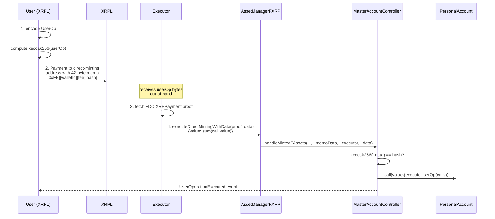

import ThemedImage from "@theme/ThemedImage";
import useBaseUrl from "@docusaurus/useBaseUrl";

The **hash** custom instruction (memo opcode `0xFE`) is a variant of the [Full Custom Instruction](/smart-accounts/full-custom-instruction) that decreases the memo field size.
Instead of ABI-encoding the full `PackedUserOperation` into the XRPL memo, the user commits to it by placing `keccak256(userOp)` in a 42-byte memo, and an off-chain executor delivers the actual user operation bytes to the FAssets `AssetManager` on Flare.

It exists because the XRPL `Payment` memo field is capped at `1024` bytes, and the ABI-encoded `PackedUserOperation` exceeded that cap for non-trivial workloads.
Integrations had to split a logical user operation across multiple XRPL payments — paying the FAssets minting and executor fees each time — and any single call whose calldata alone overran the budget could not be expressed at all, forcing teams to deploy purpose-built **shim contracts** that compressed the on-chain call into something the memo could fit.
The hash flow removes both constraints: the memo is a constant 42 bytes regardless of batch size, so arbitrarily large user operations fit in a single payment.

A side-by-side comparison of the two flows is available in the [Custom Instruction Comparison](/smart-accounts/custom-instruction-comparison).

:::warning No destination tags
XRPL transactions targeting smart accounts must not use a destination tag.
A destination tag forces [FAssets direct minting](/fassets/direct-minting) to credit the tag-holder, which would let an unrelated party front-run the user operation.
:::

## Why a hash variant

The XRPL memo field caps at `1024` bytes, and the ABI-encoded `PackedUserOperation` grows linearly with the size of the call batch.
Two problems followed from that cap in the full (`0xFF`) flow:

- **Batching tax.** A large batch — or one containing long `bytes` arguments — overflows the memo. The caller has to split the work across multiple XRPL payments and pay the FAssets minting fee and executor fee on each one, even though logically it is a single user operation.
- **Shim contracts.** A single call whose ABI-encoded calldata alone exceeded the memo budget could not be expressed at all. Integrations worked around this by deploying small **shim contracts** on Flare whose only job was to fan a compact input out into the real call(s) — extra deployment, extra audit surface, extra hops at execution time.

The hash flow removes both constraints by keeping the memo at a fixed **42 bytes** regardless of batch size, and by moving the user-operation bytes off the XRPL ledger entirely.
Arbitrarily large user operations fit in a single XRPL payment, and shim contracts that exist purely to dodge the memo cap are no longer needed.

This also makes the call payload **private on XRPL**.
Only the 32-byte commitment is published; the inner `target`, `value`, and `data` of each call only become visible when the executor submits the user operation to Flare.

## Three-step protocol

The 0xFE flow runs three steps that map onto two independent actors in production.
A demo script can run all three from the same process, but the on-chain checks are designed around the two-actor split.
The executor bridges the XRPL payment to Flare with a proof from the [Flare Data Connector (FDC)](/fdc/overview), the same attestation system used by the proof-based flow:



### Step 1: user side

The user constructs the `PackedUserOperation` the same way as for the [full flow](/smart-accounts/full-custom-instruction#user-operation-payload) — only `sender`, `nonce`, and `callData` are validated on-chain — and computes `keccak256` over the ABI-encoded user operation.
The 42-byte XRPL memo then carries:

| Bytes   | Field            | Meaning                                                             |
| ------- | ---------------- | ------------------------------------------------------------------- |
| `0`     | `instructionId`  | `0xFE` — hash custom instruction                                    |
| `1`     | `walletId`       | One-byte wallet identifier assigned by Flare; `0` if not registered |
| `2-9`   | `executorFeeUBA` | Executor fee in the FAsset's smallest unit, big-endian `uint64`     |
| `10-41` | `userOpHash`     | `keccak256(abi.encode(userOp))` — the 32-byte commitment            |

The user sends an XRPL `Payment` to the FAssets direct-minting address with this memo, and delivers the full `PackedUserOperation` bytes to the executor **out-of-band** (e.g. over an authenticated HTTP API).
The bytes never appear on the XRPL ledger.

### Step 2: executor side

The executor takes the XRPL transaction hash, requests an [`IXRPPayment` attestation](/fdc/attestation-types/payment) from the [Flare Data Connector](/fdc/overview), and calls `executeDirectMintingWithData` on `AssetManagerFXRP` (see the [FAssets direct minting page](/fassets/direct-minting)):

```solidity
function executeDirectMintingWithData(
    IXRPPayment.Proof calldata _payment,
    bytes calldata _data
) external payable;
```

- `_payment` is the FDC proof of the XRPL `Payment`.
- `_data` is the ABI-encoded `PackedUserOperation` that was delivered out-of-band.
- `msg.value` **must equal the sum of `call.value` across the user operation**.
  `AssetManagerFXRP` forwards this value into `MasterAccountController.handleMintedFAssets`, which forwards it again into the personal account's `executeUserOp` so the inner calls can attach native value.

The `executeDirectMintingWithData` function is **only valid for smart-account targets** — calling it for a non-smart-account direct mint reverts.

### Step 3: confirmation

The `MasterAccountController` verifies on-chain that `keccak256(_data) == userOpHash` from the memo.
If it matches, it decodes `_data` as a `PackedUserOperation`, validates `sender` and `nonce`, executes `executeUserOp` on the personal account, and emits [`UserOperationExecuted`](/smart-accounts/reference/IMasterAccountController#useroperationexecuted) — **all inside the executor's transaction**.
This is the key difference from the proof-based dispatch: there is no separate cross-chain wait, because the executor's call already executed the user operation by the time it returns.

## Hash mismatch

If the bytes the executor submits do not hash to the commitment in the memo, `handleMintedFAssets` reverts with `CustomInstructionHashMismatch(expected, actual)`.
The FAsset transfer is performed before the memo is decoded, however, so even on a mismatch the FXRP credited by direct minting remains in the personal account, and the user can recover by issuing a fresh user operation (see [Failure Handling](#failure-handling)).

## Call value accounting

For the full flow, the inner calls can attach native value because the XRPL memo defines the user operation in full and the controller forwards `msg.value` from the executor's transaction.
The hash flow uses the same path: whatever native value the executor attaches to `executeDirectMintingWithData` is forwarded all the way to `executeUserOp`.

The executor must therefore compute the total native value to attach as the sum of `call.value` across the user operation it received out-of-band.
The user-side helper in the [TypeScript guide](/smart-accounts/guides/typescript-viem/hash-custom-instruction-ts) returns this value alongside the XRPL transaction hash, so the executor does not have to recompute it from scratch.

## Replay protection

The hash flow shares the same replay protections as the [full flow](/smart-accounts/full-custom-instruction#replay-protection):

- The user operation's `nonce` must equal the personal account's current memo-instruction nonce; the nonce auto-increments on every successful execution.
- The XRPL transaction ID is recorded in the controller and cannot be reused for a second mint.

There is no additional replay vector specific to the hash channel: the on-chain hash check pins the executor's `_data` to the exact bytes the user signed via XRPL.

## Failure Handling

The hash-specific failure modes layer on top of the [full flow's](/smart-accounts/full-custom-instruction#failure-handling) failure modes:

- If the memo length is not exactly `42` bytes, `handleMintedFAssets` reverts with [`InvalidMemoData`](/smart-accounts/reference/IMasterAccountController#invalidmemodata).
- If `keccak256(_data)` does not match the hash in the memo, the call reverts with `CustomInstructionHashMismatch(expected, actual)`.
- If the executor's `msg.value` is less than the sum of `call.value` across the inner calls, the inner call reverts with [`CallFailed`](/smart-accounts/reference/IPersonalAccount#callfailed) and the whole user operation reverts.
- If the personal account has pinned an executor via [`getExecutor`](/smart-accounts/reference/IMasterAccountController#getexecutor) and the caller of `executeDirectMintingWithData` is not that executor, the call reverts with [`WrongExecutor`](/smart-accounts/reference/IMasterAccountController#wrongexecutor).

Because the FAsset transfer happens before the memo is decoded, **the FXRP mint succeeds even if the user operation reverts** — see [`DirectMintingExecuted`](/smart-accounts/reference/IMasterAccountController#directmintingexecuted).
The minted FXRP remains in the personal account and the user can recover by either re-submitting a fixed user operation (with the next nonce) or moving the FXRP through standard [FAssets instructions](/smart-accounts/fasset-instructions).

## Next steps

- Walk through a Viem implementation in the [Hash Custom Instruction TypeScript guide](/smart-accounts/guides/typescript-viem/hash-custom-instruction-ts).
- See when to pick `0xFE` over `0xFF` in the [Custom Instruction Comparison](/smart-accounts/custom-instruction-comparison).
- Dig into `IMasterAccountController` in the [reference](/smart-accounts/reference/IMasterAccountController).
