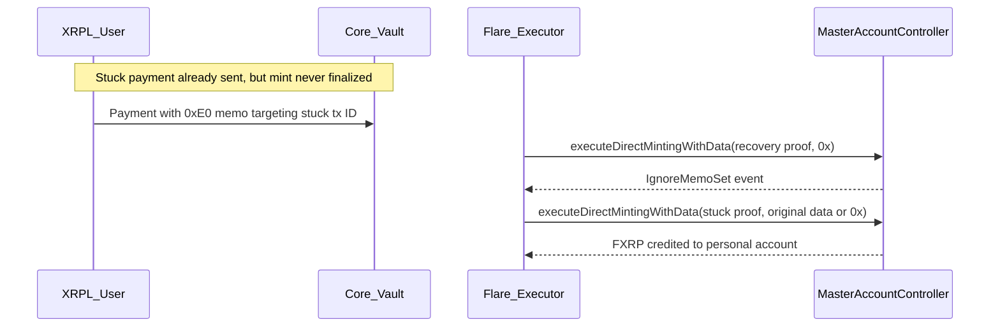

import CodeBlock from "@theme/CodeBlock";
import RecoverDirectMintTransactionScript from "!!raw-loader!/examples/developer-hub-javascript/smart-accounts/recover-direct-mint-transaction.ts";

This guide walks through recovering FXRP when a smart-account [direct mint](/fassets/direct-minting) payment is stuck at the [Core Vault](/fassets/core-vault) — typically because [`executeDirectMintingWithData`](/fassets/reference/IAssetManager#executedirectmintingwithdata) reverted on Flare or the executor never submitted the [FDC](/fdc/overview) proof.

The recovery path uses the memo opcode **`0xE0` (Skip memo)** to mark the stuck XRPL transaction ID, then resubmits the original payment so FXRP is minted to the personal account **without** running the original custom instruction.

Read the [Custom Instruction TypeScript guide](/smart-accounts/guides/typescript-viem/custom-instruction-ts) first if you are not familiar with the `0xFE` hash-commitment flow.

The full code is available on [GitHub](https://github.com/flare-foundation/flare-viem-starter/blob/main/src/recover-direct-mint-transaction.ts).

:::info
The code in this guide is set up for the Coston2 testnet.
Despite that, we refer to the network as Flare and its currency as FLR, rather than Coston2 and C2FLR.
:::

## Recovery Conditions

Recovery is appropriate when:

- An XRPL `Payment` to the Core Vault carried a smart-account memo (`0xFE` or `0xFF`), but **no FXRP was minted** on Flare.
- The underlying XRP is still at the Core Vault, and the stuck transaction ID is **not yet recorded** as used on-chain (`isTransactionIdUsed` returns `false`).

Recovery does **not** apply when the stuck payment was already finalized on Flare — in that case, `0xE0` recovery will fail at diagnosis.

## Recovery Process

Recovery mints **FXRP to your personal account**, not native XRP back on XRPL.
The stuck payment's XRP (minus fees) is converted to FXRP; the original user operation is skipped.

To move value back to XRPL after recovery:

- Use standard [FAssets instructions](/smart-accounts/fasset-instructions) (opcode `0x02` redeem), or
- Call [`AssetManager.redeem`](/fassets/reference/IAssetManager#redeem) from the personal account.

The recovery payment itself also mints a small amount of FXRP (default `1` net XRP) because **fee-only direct mints revert on-chain** — the `0xE0` flag must ride on a payment with a positive net mint amount.

## Flow Diagram



The example script runs all steps end-to-end for demonstration on Coston2.

## Memo Layout

The `0xE0` skip-memo instruction uses the same 42-byte header shape as `0xFE` and `0xFF`:

`[0xE0 | walletId(1B) | executorFeeUBA(8B) | targetTxId(32B)]`

`sendSkipMemoInstruction` encodes this memo and sends an XRPL `Payment` to the [direct minting payment address](/fassets/reference/IAssetManager#directmintingpaymentaddress):

```typescript
skipMemo = await sendSkipMemoInstruction({
  label: "skip-memo",
  targetXrplTxHash: stuckXrplTxHash,
  personalAccount,
  xrplClient,
  xrplWallet,
  recoveryNetMintAmountXrp: 1,
});
```

The gross XRP amount equals the net mint plus minting and executor fees, computed by `computeDirectMintingPaymentAmountXrp`.

:::warning No destination tags
XRPL payments targeting smart accounts must not use a destination tag.
:::

## Finalize the Recovery Payment

The executor fetches an FDC [`XRPPayment`](/fdc/attestation-types/xrp-payment) proof for the recovery payment and calls [`executeDirectMintingWithData`](/fassets/reference/IAssetManager#executedirectmintingwithdata) with empty `_data`:

```typescript
({ receipt: recoveryReceipt } = await executeDirectMintingWithData({
  xrplTransactionHash: skipMemo.xrplTransactionHash,
  data: "0x",
  value: 0n,
  xrplClient,
  label: "skip-memo-executor",
  reuseExistingMint: true,
}));
```

On success, the receipt contains an [`IgnoreMemoSet`](/smart-accounts/reference/IMasterAccountController#ignorememoset) event tying the personal account to the stuck transaction ID:

```typescript
const ignoreMemoSet = findIgnoreMemoSet(
  recoveryReceipt,
  personalAccount,
  targetTxId,
);
```

The recovery payment also mints FXRP (the small net amount from step 1) to the personal account.

## Resubmit the Stuck Payment

With `ignoreMemo` set, the executor resubmits the **original** stuck XRPL payment:

```typescript
const { receipt: stuckReceipt } = await executeDirectMintingWithData({
  xrplTransactionHash: stuckXrplTxHash,
  data: stuckUserOpData ?? "0x",
  value: 0n,
  xrplClient,
  label: "stuck-retry",
  reuseExistingMint: true,
});
```

The `_data` parameter depends on how the stuck payment was encoded:

| Stuck flow               | `STUCK_USER_OP_DATA`                                                                  | `_data` on retry                |
| :----------------------- | :------------------------------------------------------------------------------------ | :------------------------------ |
| `0xFE` (hash-commitment) | Required — ABI-encoded `PackedUserOperation` bytes from the original user-side helper | Same bytes                      |
| `0xFF` (inline memo)     | Not required                                                                          | `"0x"` is sufficient on Coston2 |

Because `ignoreMemo` is active, the controller mints FXRP without dispatching the original user operation.

## Relayer Edge Cases

The script handles two race conditions common on testnet:

1. **Recovery payment already finalized** — if a relayer minted the `0xE0` payment while you were waiting, `isStuckTransactionIdUsed` returns `true` for the recovery tx ID and the script loads the existing receipt via `findDirectMintingReceiptForTransactionId` instead of resubmitting.

2. **Stuck payment finalized during recovery** — if a relayer finalized the original stuck payment after `IgnoreMemoSet` was recorded, step 3 loads that receipt instead of calling `executeDirectMintingWithData` again.

Both paths use `reuseExistingMint: true` so `PaymentAlreadyConfirmed` errors from duplicate submissions are handled gracefully.

## Running the Script

Clone [flare-viem-starter](https://github.com/flare-foundation/flare-viem-starter), configure `.env`, and run:

```bash
STUCK_XRPL_TX_HASH=<your-stuck-tx-hash> pnpm run script src/recover-direct-mint-transaction.ts
```

For a `0xFE` stuck payment, also pass the original user-operation bytes:

```bash
STUCK_XRPL_TX_HASH=<hash> \
STUCK_USER_OP_DATA=<packed-user-op-hex> \
pnpm run script src/recover-direct-mint-transaction.ts
```

If you already sent the `0xE0` recovery payment, resume from step 2:

```bash
STUCK_XRPL_TX_HASH=<stuck-hash> \
RECOVERY_XRPL_TX_HASH=<recovery-hash> \
pnpm run script src/recover-direct-mint-transaction.ts
```

## Full Script

The repository with the example is available on [GitHub](https://github.com/flare-foundation/flare-viem-starter).
Helper functions live in the `src/utils` directory.

<details>
  <summary>src/recover-direct-mint-transaction.ts</summary>
  <CodeBlock
    language="typescript"
    title="src/recover-direct-mint-transaction.ts"
  >
    {RecoverDirectMintTransactionScript}
  </CodeBlock>
</details>

<details>
  <summary>Expected Output</summary>
```bash
Personal account address: 0xFd2f0eb6b9fA4FE5bb1F7B26fEE3c647ed103d9F

Stuck XRPL transaction hash: FEAC1ABDB81809293E023DB9345715FA3A27949B23132AB9A2417D8F99A876E9

FXRP balance before recovery: 0

--- Stuck direct mint diagnosis ---
targetTxId: 0xfeac1abdb81809293e023db9345715fa3a27949b23132ab9a2417d8f99a876e9
isTransactionIdUsed: false
current memo nonce: 58
pinned executor: 0x0000000000000000000000000000000000000000
Transaction not yet minted on Flare — recovery via 0xE0 is applicable.

XRPL wallet XRP balance: 1000

=== RECOVERY: 0xE0 skip-memo flow ===

[skip-memo] 0xE0 skip-memo targeting: 0xfeac1abdb81809293e023db9345715fa3a27949b23132ab9a2417d8f99a876e9

[skip-memo] recovery payment amount (XRP, net mint 1 + fees): 1.2

[skip-memo] recovery XRPL transaction hash: A1B2C3D4E5F6...

[skip-memo-executor] FXRP credited to personal account: 0xFd2f0eb6b9fA4FE5bb1F7B26fEE3c647ed103d9F
[skip-memo-executor] Amount (UBA): 1000000

IgnoreMemoSet event: { ... }

[stuck-retry] FXRP credited to personal account: 0xFd2f0eb6b9fA4FE5bb1F7B26fEE3c647ed103d9F
[stuck-retry] Amount (UBA): 10000000

FXRP balance after recovery: 11000000

FXRP recovered: 11000000

```
</details>

Exact fee and amount values depend on live `AssetManagerFXRP` parameters.

:::tip[What's next]

- Walk through the happy-path `0xFE` flow in the [Custom Instruction TypeScript guide](/smart-accounts/guides/typescript-viem/custom-instruction-ts).
- If `0xE0` recovery minted FXRP but the memo-instruction nonce is still stuck, advance it with the [Fast-Forward Nonce guide](/smart-accounts/guides/typescript-viem/fast-forward-nonce-ts) (`0xE1`).
- Redeem recovered FXRP to XRPL using [FAssets instructions](/smart-accounts/fasset-instructions) or the [Redeem guide](/fassets/developer-guides/fassets-redeem).

:::

```
