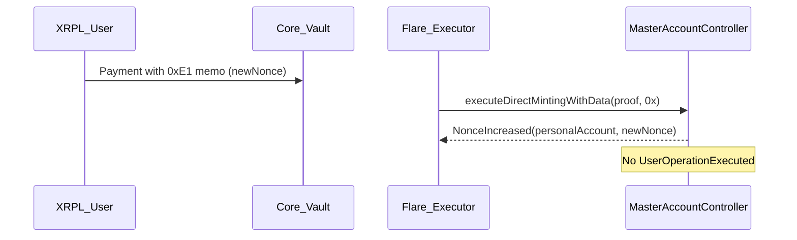
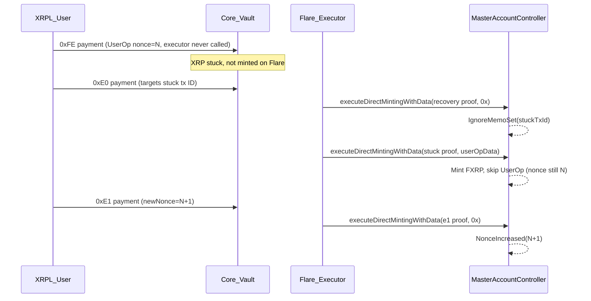

import CodeBlock from "@theme/CodeBlock";
import FastForwardNonceScript from "!!raw-loader!/examples/developer-hub-javascript/smart-accounts/fast-forward-nonce.ts";

This guide walks through advancing a personal account's **memo-instruction nonce** when it is stuck after a partial or abandoned [direct mint](/fassets/direct-minting) flow.

The recovery path uses the memo opcode **`0xE1` (Fast-forward nonce)** to jump the nonce forward on Flare **without** executing a user operation.
A small amount of FXRP is minted alongside the flag because fee-only direct mints revert on-chain.

Read the [Custom Instruction TypeScript guide](/smart-accounts/guides/typescript-viem/custom-instruction-ts) first if you are not familiar with [`getNonce`](/smart-accounts/reference/IMasterAccountController#getnonce) and the `0xFE` hash-commitment flow.
If FXRP is still stuck at the [Core Vault](/fassets/core-vault) because the mint never finalized, complete the [`0xE0` recovery](/smart-accounts/guides/typescript-viem/recover-stuck-mint-transaction-ts) before using `0xE1`.

The full code is available on [GitHub](https://github.com/flare-foundation/flare-viem-starter/blob/main/src/fast-forward-nonce.ts).

:::info
The code in this guide is set up for the Coston2 testnet.
Despite that, we refer to the network as Flare and its currency as FLR, rather than Coston2 and C2FLR.
:::

## Usage of `0xE1`

`0xE1` solves a specific stuck state: FXRP was minted (or the payment was recovered), but the memo-instruction nonce did not advance because the original `PackedUserOperation` was never executed.

| Situation                                                                                                                                  | Action                                                                                                                          |
| :----------------------------------------------------------------------------------------------------------------------------------------- | :------------------------------------------------------------------------------------------------------------------------------ |
| Stuck payment **not yet minted** on Flare (`isTransactionIdUsed == false`)                                                                 | Use [`0xE0`](/smart-accounts/guides/typescript-viem/recover-stuck-mint-transaction-ts) first — not `0xE1`                       |
| After `0xE0` recovery, nonce still points at an abandoned UserOp                                                                           | Use `0xE1` to skip past it before sending a fresh `0xFE` or `0xFF` instruction                                                  |
| Nonce already advanced by a successful [`UserOperationExecuted`](/smart-accounts/reference/IMasterAccountController#useroperationexecuted) | Read [`getNonce`](/smart-accounts/reference/IMasterAccountController#getnonce) and build the next UserOp — `0xE1` is not needed |

A common trigger is [`0xE0` skip-memo recovery](/smart-accounts/custom-instruction#recovery-after-a-failed-mint): the controller mints FXRP from the stuck payment but deliberately skips the original user operation, leaving the nonce unchanged.

## Memo-Instruction Nonce

Each XRPL-linked personal account maintains a monotonic **memo-instruction nonce** exposed by [`getNonce(personalAccount)`](/smart-accounts/reference/IMasterAccountController#getnonce).

Every `0xFE` or `0xFF` user operation must embed `PackedUserOperation.nonce == getNonce(personalAccount)`.
On successful execution, the contract emits [`UserOperationExecuted`](/smart-accounts/reference/IMasterAccountController#useroperationexecuted) and increments the nonce.

When a direct mint finalizes without running the user operation — for example after `0xE0` recovery or when an executor never submitted the original payment — the nonce stays at the abandoned slot.
Any new payment built with the current `getNonce` still references that slot semantically, even though the original UserOp will never run.

`0xE1` explicitly jumps the counter forward (for example `N → N+1`) so you can build a fresh user operation.

## Flow Diagram



The canonical flow has two steps:

1. **User side** — XRPL `Payment` to the [direct minting payment address](/fassets/reference/IAssetManager#directmintingpaymentaddress) with a `0xE1` memo (requires a positive net mint).
2. **Executor side** — finalize via [`executeDirectMintingWithData`](/fassets/reference/IAssetManager#executedirectmintingwithdata) with `_data = "0x"` because no user-operation bytes are needed.

## Memo Layout

The `0xE1` fast-forward instruction uses the same 42-byte header shape as `0xE0`, `0xFE`, and `0xFF`:

`[0xE1 | walletId(1B) | executorFeeUBA(8B) | newNonce(32B)]`

`sendFastForwardNonceInstruction` encodes this memo and sends an XRPL `Payment`:

```typescript
fastForward = await sendFastForwardNonceInstruction({
  label: "fast-forward-nonce",
  newNonce: targetNewNonce,
  personalAccount,
  xrplClient,
  xrplWallet,
  netMintAmountXrp: 1,
});
```

The gross XRP amount equals the net mint plus minting and executor fees, computed by the `computeDirectMintingPaymentAmountXrp` function.

:::warning No destination tags
XRPL payments targeting smart accounts must not use a destination tag.
:::

## On-Chain Rules

Before sending the XRPL payment, validate the target nonce client-side with `assertValidNonceIncrease`:

- `newNonce` must be **strictly greater** than the current nonce.
- The jump `newNonce - currentNonce` must not exceed `type(uint32).max`.

On-chain, an invalid increase reverts with [`InvalidNonceIncrease`](/smart-accounts/reference/IMasterAccountController#invalidnonceincrease).

The payment must carry a **positive net mint** amount.
Fee-only direct mints revert — the `0xE1` flag must ride on a payment that mints FXRP.

On success, the receipt contains a [`NonceIncreased`](/smart-accounts/reference/IMasterAccountController#nonceincreased) event and **no** [`UserOperationExecuted`](/smart-accounts/reference/IMasterAccountController#useroperationexecuted) event.

## Finalize on Flare

The executor fetches an FDC [`XRPPayment`](/fdc/attestation-types/xrp-payment) proof for the `0xE1` payment and calls `executeDirectMintingWithData` with empty `_data`:

```typescript
({ receipt } = await executeDirectMintingWithData({
  xrplTransactionHash: fastForward.xrplTransactionHash,
  data: "0x",
  value: 0n,
  xrplClient,
  label: "fast-forward-executor",
  reuseExistingMint: true,
}));
```

Verify the nonce advance from the receipt and on-chain state:

```typescript
const nonceIncreased = findNonceIncreased(
  receipt,
  personalAccount,
  targetNewNonce,
);
const nonceAfter = await getNonce(personalAccount);
```

After `0xE1`, build your next `0xFE` or `0xFF` user operation with `nonce == nonceAfter`.

## Full Recovery Context (Demo)

The example script can run an end-to-end demonstration on Coston2:

1. **Abandoned `0xFE` payment** — send a direct-mint payment with a user operation but deliberately skip the executor call so XRP sits at the Core Vault.
2. **`0xE0` recovery** — recover FXRP from the stuck payment without running the UserOp (nonce unchanged).
3. **`0xE1` fast-forward** — advance the nonce past the abandoned slot.



For step 2 only, see the dedicated [Recover Stuck Mint Transaction guide](/smart-accounts/guides/typescript-viem/recover-stuck-mint-transaction-ts).

## Relayer Edge Cases

The script handles race conditions common on testnet:

1. **`0xE1` payment already finalized** — if a relayer minted the payment while you were waiting, `isStuckTransactionIdUsed` returns `true` for the `0xE1` tx ID and the script loads the existing receipt via `findDirectMintingReceiptForTransactionId` instead of resubmitting.

2. **Stuck payment already minted before `0xE0`** — if the original payment was finalized during recovery, the script skips the `0xE0` path and proceeds directly to `0xE1` when appropriate.

Both paths use `reuseExistingMint: true` so `PaymentAlreadyConfirmed` errors from duplicate submissions are handled gracefully.

## Full Script

The repository with the example is available on [GitHub](https://github.com/flare-foundation/flare-viem-starter).
Helper functions live in the `src/utils` directory.

<details>
  <summary>src/fast-forward-nonce.ts</summary>
  <CodeBlock language="typescript" title="src/fast-forward-nonce.ts">
    {FastForwardNonceScript}
  </CodeBlock>
</details>

<details>
  <summary>Expected Output</summary>
```bash
Personal account address: 0xFd2f0eb6b9fA4FE5bb1F7B26fEE3c647ed103d9F

Memo nonce before demo: 58

=== DEMO: creating abandoned 0xFE payment ===

[abandoned-demo] current nonce: 58n

Abandoned XRPL transaction hash (save for resume): FEAC1ABDB81809293E023DB9345715FA3A27949B23132AB9A2417D8F99A876E9

UserOp nonce embedded in that payment: 58n

=== RECOVERY: 0xE0 skip-memo flow ===

0xE0 recovers FXRP from the stuck payment but does not run the UserOp — the memo nonce stays at 58

[skip-memo] 0xE0 skip-memo targeting: 0xfeac1abdb81809293e023db9345715fa3a27949b23132ab9a2417d8f99a876e9

IgnoreMemoSet event: { ... }

Memo nonce after 0xE0 recovery (unchanged — UserOp was skipped): 58

After 0xE0 the nonce is still 58 — the abandoned UserOp at nonce 58 was never executed. Fast-forwarding to 59 with 0xE1.

=== FAST-FORWARD NONCE: 0xE1 flow ===

Current memo nonce: 58

Target new nonce: 59

[fast-forward-nonce] 0xE1 fast-forward nonce to: 59n

[fast-forward-nonce] memo (42 bytes): 0xE1000000000000000000000000000000000000000000000000000000000000003b

NonceIncreased event: {
args: {
personalAccount: '0xFd2f0eb6b9fA4FE5bb1F7B26fEE3c647ed103d9F',
newNonce: 59n
}
}

Memo nonce after fast-forward: 59

Nonce fast-forward complete. Build your next 0xFE or 0xFF UserOp with nonce: 59

```
</details>

Exact fee and amount values depend on live `AssetManagerFXRP` parameters.

:::tip[What's next]

- Walk through the happy-path `0xFE` flow in the [Custom Instruction TypeScript guide](/smart-accounts/guides/typescript-viem/custom-instruction-ts).
- If FXRP is still stuck at the Core Vault, start with the [Recover Stuck Mint Transaction guide](/smart-accounts/guides/typescript-viem/recover-stuck-mint-transaction-ts) (`0xE0`) before fast-forwarding the nonce.

:::
```
