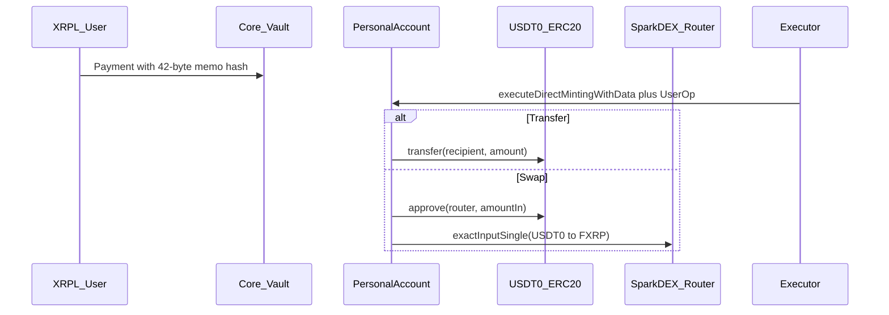

import CodeBlock from "@theme/CodeBlock";
import Usdt0BalanceScript from "!!raw-loader!/examples/developer-hub-javascript/smart-accounts/usdt0/balance.ts";
import Usdt0TransferScript from "!!raw-loader!/examples/developer-hub-javascript/smart-accounts/usdt0/transfer.ts";
import Usdt0SwapScript from "!!raw-loader!/examples/developer-hub-javascript/smart-accounts/usdt0/swap-usdt0-to-fxrp.ts";
import Usdt0ConfigScript from "!!raw-loader!/examples/developer-hub-javascript/smart-accounts/usdt0/config.ts";

This guide shows how to control [USDT0](https://docs.usdt0.to/) held by a Flare [personal account](/smart-accounts/overview) through an XRPL wallet.
We will read the account's USDT0 balance, transfer USDT0 to another EVM address, and swap USDT0 for FXRP on [SparkDEX](https://sparkdex.ai/) — all through fee-only [`0xFE` custom instructions](/smart-accounts/custom-instruction).

Unlike the minting demos in the [Custom Instruction TypeScript guide](/smart-accounts/guides/typescript-viem/custom-instruction-ts), these flows set `netMintAmountXrp: 0`.
The XRPL payment covers only direct minting and executor fees; no FXRP is minted.
The personal account already holds USDT0 (and native FLR for any call values), and the user operation moves that ERC-20 balance.

Read the [Custom Instruction TypeScript guide](/smart-accounts/guides/typescript-viem/custom-instruction-ts) first if you are not familiar with the `0xFE` hash-commitment flow, `sendHashInstruction`, or [`executeDirectMintingWithData`](/fassets/reference/IAssetManager#executedirectmintingwithdata).

The full code is available on [GitHub](https://github.com/flare-foundation/flare-viem-starter/tree/main/src/usdt0).

:::info
The code in this guide is set up for the Coston2 testnet.
Despite that, we refer to the network as Flare and its currency as FLR, rather than Coston2 and C2FLR.
:::

## Prerequisites

Before running `transfer.ts` or `swap-usdt0-to-fxrp.ts`:

1. Configure `.env` in [flare-viem-starter](https://github.com/flare-foundation/flare-viem-starter) with `XRPL_TESTNET_RPC_URL`, `XRPL_SEED`, and `PRIVATE_KEY` (executor wallet for the Flare submission step).
2. Derive your personal account address with the [State Lookup guide](/smart-accounts/guides/typescript-viem/state-lookup-ts#personal-account-of-an-xrpl-address) (or the read-only `balance.ts` script below).
3. Fund that EVM address with FLR and USDT0 from the [Coston2 faucet](https://faucet.flare.network/coston2).

The XRPL wallet must hold enough XRP to cover the fee-only payment amount returned by `computeDirectMintingPaymentAmountXrp({ netMintAmountXrp: 0 })`.

## Addresses and Config

Constants live in the `src/usdt0/config.ts` file.

On Coston2, the scripts use:

| Constant                           | Value                                                                                                                                                  | Notes                                                                                                                                                              |
| :--------------------------------- | :----------------------------------------------------------------------------------------------------------------------------------------------------- | :----------------------------------------------------------------------------------------------------------------------------------------------------------------- |
| `USDT0_ADDRESS`                    | [`0xC1A5B41512496B80903D1f32d6dEa3a73212E71F`](https://coston2-explorer.flare.network/address/0xC1A5B41512496B80903D1f32d6dEa3a73212E71F)              | Coston2 USDT0. Mainnet is [`0xe7cd86e13AC4309349F30B3435a9d337750fC82D`](https://flare-explorer.flare.network/address/0xe7cd86e13AC4309349F30B3435a9d337750fC82D). |
| `SWAP_ROUTER_ADDRESS`              | [`0x8a1E35F5c98C4E85B36B7B253222eE17773b2781`](https://coston2-explorer.flare.network/address/0x8a1E35F5c98C4E85B36B7B253222eE17773b2781?tab=contract) | SparkDEX Uniswap V3 SwapRouter                                                                                                                                     |
| `POOL_FEE`                         | `500`                                                                                                                                                  | 0.05% fee tier for the USDT0/FXRP pool                                                                                                                             |
| `DEFAULT_AMOUNT_IN_UNITS`          | `1`                                                                                                                                                    | Transfer / swap size in whole USDT0 units                                                                                                                          |
| `DEFAULT_AMOUNT_OUT_MINIMUM_UNITS` | `"0.3"`                                                                                                                                                | Demo slippage floor in whole FXRP units — tune against the live pool before larger amounts                                                                         |

FXRP is resolved at runtime with `getFxrpAddress()` from the [Flare Contract Registry](/network/guides/flare-contracts-registry), not hardcoded.

The EOA-oriented SparkDEX pattern (without smart accounts) is documented in [Swap USDT0 to FXRP](/fxrp/token-interactions/usdt0-fxrp-swap).

<details>
  <summary>src/usdt0/config.ts</summary>
  <CodeBlock language="typescript" title="src/usdt0/config.ts">
    {Usdt0ConfigScript}
  </CodeBlock>
</details>

## Flow Overview



Both `transfer.ts` and `swap-usdt0-to-fxrp.ts` follow the same three-step `0xFE` protocol used elsewhere in the starter:

1. **User side** — encode the `Call[]`, commit `keccak256(PackedUserOperation)` in a 42-byte XRPL memo, send a fee-only Payment.
2. **Executor side** — fetch an FDC Payment proof and call [`executeDirectMintingWithData`](/fassets/reference/IAssetManager#executedirectmintingwithdata) with the UserOp bytes.
3. **Confirmation** — read `UserOperationExecuted` from the receipt and compare balances.

## Check Balance

The `balance.ts` script is read-only.
It derives the personal account from the `XRPL_SEED` environment variable, then prints USDT0 `decimals`, `balanceOf`, and `allowance` to the SparkDEX SwapRouter.

```typescript
const personalAccount = await getPersonalAccountAddress(xrplWallet.address);
const decimals = await readUsdt0Decimals();

const [balance, allowance] = await Promise.all([
  readUsdt0Balance(personalAccount),
  readUsdt0Allowance(personalAccount, SWAP_ROUTER_ADDRESS),
]);
```

Helpers in `src/usdt0/utils.ts` wrap Viem `readContract` calls against the USDT0 ERC-20 ABI.

Run:

```bash
pnpm run script src/usdt0/balance.ts
```

If the balance is zero, faucet USDT0 to the printed personal account address before continuing.

## Transfer USDT0

The `transfer.ts` script builds a single-call UserOp that invokes `USDT0.transfer(recipient, amount)` from the personal account.

The payment amount is fee-only:

```typescript
const [personalAccount, memoOnlyAmountXrp, decimals] = await Promise.all([
  getPersonalAccountAddress(xrplWallet.address),
  computeDirectMintingPaymentAmountXrp({ netMintAmountXrp: 0 }),
  readUsdt0Decimals(),
]);
const amount = toTokenAmount(DEFAULT_AMOUNT_IN_UNITS, decimals);
```

The call batch is one ERC-20 transfer:

```typescript
const customInstruction: Call[] = [
  {
    target: USDT0_ADDRESS,
    value: 0n,
    data: encodeFunctionData({
      abi: ERC20Abi,
      functionName: "transfer",
      args: [recipient, amount],
    }),
  },
];
```

Then the script runs the three `0xFE` steps inline:

```typescript
const userSide = await sendHashInstruction({
  label: "transfer-usdt0",
  customInstruction,
  amountXrp: memoOnlyAmountXrp,
  personalAccount,
  xrplClient,
  xrplWallet,
});

const { receipt } = await executeDirectMintingWithData({
  xrplTransactionHash: userSide.xrplTransactionHash,
  data: userSide.data,
  value: userSide.totalCallValue,
  xrplClient,
  label: "transfer-usdt0",
});

const event = findUserOperationExecuted(
  receipt,
  personalAccount,
  userSide.nonce,
);
```

The `DEFAULT_TRANSFER_RECIPIENT` constant in `config.ts` is a hardcoded demo address — change it before sending real funds.

:::warning No destination tags
XRPL payments targeting smart accounts must not use a destination tag.
:::

Run:

```bash
pnpm run script src/usdt0/transfer.ts
```

## Swap USDT0 to FXRP

The `swap-usdt0-to-fxrp.ts` script swaps USDT0 for FXRP on SparkDEX from the personal account.
The XRPL payment is again fee-only; the FXRP received comes from the DEX pool, not from an FAssets mint.

The UserOp batches two calls atomically:

1. `USDT0.approve(SwapRouter, amountIn)`
2. `SwapRouter.exactInputSingle` with `tokenIn = USDT0`, `tokenOut = FXRP`, `recipient = personalAccount`

```typescript
const customInstruction: Call[] = [
  {
    target: USDT0_ADDRESS,
    value: 0n,
    data: encodeFunctionData({
      abi: ERC20Abi,
      functionName: "approve",
      args: [SWAP_ROUTER_ADDRESS, amountIn],
    }),
  },
  {
    target: SWAP_ROUTER_ADDRESS,
    value: 0n,
    data: encodeFunctionData({
      abi: swapRouterAbi,
      functionName: "exactInputSingle",
      args: [
        {
          tokenIn: USDT0_ADDRESS,
          tokenOut: fxrpAddress,
          fee: POOL_FEE,
          recipient: personalAccount,
          deadline,
          amountIn,
          amountOutMinimum,
          sqrtPriceLimitX96: 0n,
        },
      ],
    }),
  },
];
```

The `amountOutMinimum` value is derived from `DEFAULT_AMOUNT_OUT_MINIMUM_UNITS` (`0.3` FXRP in the demo).
Treat it as a conservative floor for testnet demos; adjust it against the current pool price for larger amounts.

After execution, the script logs USDT0 spent and FXRP received by comparing balances before and after.

Run:

```bash
pnpm run script src/usdt0/swap-usdt0-to-fxrp.ts
```

## Full Scripts

The repository with the examples is available on [GitHub](https://github.com/flare-foundation/flare-viem-starter).
Shared helpers (`sendHashInstruction`, `executeDirectMintingWithData`, FDC proof helpers) live under `src/utils`.

<details>
  <summary>src/usdt0/balance.ts</summary>
  <CodeBlock language="typescript" title="src/usdt0/balance.ts">
    {Usdt0BalanceScript}
  </CodeBlock>
</details>

<details>
  <summary>src/usdt0/transfer.ts</summary>
  <CodeBlock language="typescript" title="src/usdt0/transfer.ts">
    {Usdt0TransferScript}
  </CodeBlock>
</details>

<details>
  <summary>src/usdt0/swap-usdt0-to-fxrp.ts</summary>
  <CodeBlock language="typescript" title="src/usdt0/swap-usdt0-to-fxrp.ts">
    {Usdt0SwapScript}
  </CodeBlock>
</details>

## Expected output

Values will differ slightly, but the output should follow the same format.
Exact fee amounts depend on live `AssetManagerFXRP` direct-minting parameters.

### `balance.ts`

```bash
> pnpm run script src/usdt0/balance.ts

Personal account address: 0xFd2f0eb6b9fA4FE5bb1F7B26fEE3c647ed103d9F

USDT0 address: 0xC1A5B41512496B80903D1f32d6dEa3a73212E71F

USDT0 decimals: 6

Spender (SwapRouter): 0x8a1E35F5c98C4E85B36B7B253222eE17773b2781

USDT0 balance: 10

USDT0 allowance (→ SwapRouter): 0
```

### `transfer.ts`

```bash
> pnpm run script src/usdt0/transfer.ts

Personal account address: 0xFd2f0eb6b9fA4FE5bb1F7B26fEE3c647ed103d9F

USDT0 address: 0xC1A5B41512496B80903D1f32d6dEa3a73212E71F

USDT0 decimals: 6

Recipient: 0x1cdacde0c68e0a508ae85279375070a88554871b

Memo-only amount (XRP, fees only): 0.2

Transfer amount: 1 USDT0

Personal USDT0 before: 10

Recipient USDT0 before: 0

UserOperationExecuted: { ... }

Personal USDT0 after: 9

Recipient USDT0 after: 1

USDT0 sent: 1
```

### `swap-usdt0-to-fxrp.ts`

```bash
> pnpm run script src/usdt0/swap-usdt0-to-fxrp.ts

Personal account address: 0xFd2f0eb6b9fA4FE5bb1F7B26fEE3c647ed103d9F

FXRP address: 0x0b6A3645c240605887a5532109323A3E12273dc7

USDT0 address: 0xC1A5B41512496B80903D1f32d6dEa3a73212E71F

USDT0 decimals: 6

FXRP decimals: 6

Swap router: 0x8a1E35F5c98C4E85B36B7B253222eE17773b2781

Memo-only amount (XRP, fees only): 0.2

Amount in: 1 USDT0
Amount out minimum: 0.3 FXRP

USDT0 before: 9

FXRP before: 0

UserOperationExecuted: { ... }

USDT0 after: 8

FXRP after: 0.48

USDT0 spent: 1

FXRP received: 0.48
```

:::tip[What's next]

- Re-read the [Custom Instruction](/smart-accounts/custom-instruction) protocol details and failure handling.
- Swap as an EOA (without smart accounts) in [Swap USDT0 to FXRP](/fxrp/token-interactions/usdt0-fxrp-swap).
- Compare with [gasless USD₮0 transfers](/network/guides/gasless-usdt0-transfers) if you need EIP-3009 meta-transactions instead of XRPL memo authorization.

:::
